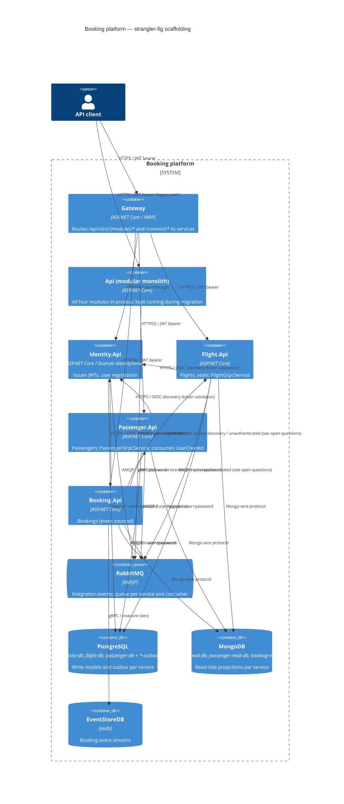

# 0001. Per-module service hosts next to the modular monolith (strangler fig)

- **Status:** Proposed
- **Date:** 2026-10-06
- **ARB ticket:** TO BE CREATED
- **Authors:** Devin (requested by Abhay Aggarwal)
- **Owning team:** Booking platform team (COG-GTM)
- **Related ADRs:** none (first ADR in this repository)

## Context

`booking-modular-monolith` ships four modules (Identity, Flight, Passenger, Booking) in a single
ASP.NET Core host (`src/Api`). Modules already talk through MassTransit integration events and gRPC,
but all of it runs in-process (in-memory transport, same Postgres server, one Mongo database), so a
module cannot be scaled, deployed or owned independently. This change introduces the first
microservice scaffolding while keeping the monolith running so traffic can be moved module by module.

Constraints: no behaviour change inside modules; the existing module extension methods
(`Add*Modules` / `Use*Modules`) stay the single composition point; tests that target the monolith
must keep working; local developer experience must stay `dotnet run` on the AppHost or
`docker compose up`.

ARB triggers: T1 (five new container images + compose services), T4 (gRPC/MassTransit contracts moved
to a shared `BuildingBlocks.Contracts` assembly), auth/network boundary (JWT resource APIs validating
tokens from a separate Identity host), new broker usage (RabbitMQ replaces the in-memory bus).
T7 flagged by the detector is a false positive: the Dockerfiles use the same .NET 10 images as the
existing `src/Api/Dockerfile`.

## Decision

We will add one ASP.NET Core minimal-API host per module under `src/Services/{Identity,Flight,Passenger,Booking}.Api`
plus a YARP gateway (`src/Services/Gateway`), run them side by side with the monolith (strangler
fig), move integration contracts (MassTransit messages, `flight.proto`, `passenger.proto`) into a
dependency-light `BuildingBlocks.Contracts` project, switch MassTransit to RabbitMQ with a per-service
queue prefix, give every service its own Postgres database (plus an outbox database) and its own Mongo
read database, keep Booking on EventStoreDB, keep `Identity.Api` as the Duende IdentityServer issuer
and make the other hosts JWT bearer resource APIs. Service-to-service gRPC goes through Aspire
service discovery (`https://flight-api`), and the Aspire AppHost / docker-compose start everything.

## Alternatives considered

| Alternative | Pros | Cons | Why rejected |
| --- | --- | --- | --- |
| Do nothing (keep the modular monolith only) | Zero migration risk, simplest ops | No independent deploy/scale, single blast radius, team coupling | Does not meet the goal of an incremental extraction path |
| Big-bang split: delete the monolith, ship only the four services | Clean end state, no duplicate processing | No fallback, data migration and cut-over must happen at once, breaks existing tests/clients | Too risky; strangler fig gives a reversible path |
| Per-module `*.Contracts` projects instead of one `BuildingBlocks.Contracts` | Finer ownership per module | Four extra projects for ~10 records and 2 protos; cross-module references anyway | Premature; can be split later without consumer changes |
| Keep in-memory transport in services and only use RabbitMQ in production | Simpler local setup | Local behaviour diverges from prod; services could not talk to each other at all | Shared broker is the point of the migration |
| Shared databases between monolith and services during coexistence | No data duplication | Schema coupling, migration conflicts (two hosts running EF migrations), no real service ownership | Database-per-service from day one; data migration is a separate cut-over phase |

## Architecture

## Non-functional requirements

| NFR | Target | How met |
| --- | --- | --- |
| Availability SLO | TBD — owner to confirm before ARB (monolith has no published SLO today) | Services are stateless; each can be scaled independently; monolith remains as fallback |
| p95 latency | TBD — owner to confirm before ARB; expect +1 hop (gateway) and +1 network hop for Booking→Flight/Passenger gRPC | Standard resilience handler (retry 3, circuit breaker) on all HTTP/gRPC clients |
| RPO / RTO | TBD — owner to confirm before ARB | Postgres/Mongo/EventStore data volumes; outbox table per service guarantees at-least-once publish |
| Peak load | TBD — demo/dev workload today | Horizontal scaling per service; RabbitMQ competing consumers per queue |
| Scaling model | One container per service, scale replicas independently | Queue-per-service naming (`<service>-<consumer>`) makes replicas share a queue |
| Data retention | Same as today (no change to schemas) | Database-per-service; retention policy TBD |

## Security & compliance

- **Data classification:** Internal / PII (passenger names, passport numbers, user accounts) — unchanged from the monolith.
- **Encryption at rest:** N/A — local containers and dev volumes; production storage encryption is handled by the hosting platform (TBD before prod).
- **Encryption in transit:** HTTPS between client, gateway and services in Aspire/local dev (dev certificate); plain HTTP inside the docker-compose `booking` network. TLS for inter-service traffic is a follow-up before production.
- **AuthN / AuthZ:** `Identity.Api` is the only Duende IdentityServer issuer (`AuthOptions:IssuerUri`). Flight/Passenger/Booking/Identity validate JWT bearer tokens (`Jwt:Authority`, per-service `Jwt:Audience` = `flight-api`, `passenger-api`, `booking-api`, `identity-api`) and enforce the existing `ApiScope` policy. gRPC between services is unauthenticated (same as in-process today) — tracked as an open question.
- **Secrets:** Dev credentials (postgres/postgres, guest/guest, client/secret) live in appsettings for local use only; Aspire injects connection strings via parameters marked `secret: true`. Production secrets must come from the platform secret store.
- **Audit logging:** Unchanged — OpenTelemetry traces/logs per service (`ObservabilityOptions:ServiceName` distinct per host).
- **Data residency / regions:** N/A — no cloud deployment in this change.
- **Policy sections satisfied:** no `policy/approved-infra.yaml` in this repository; no cloud resources introduced.
- **Threats considered:** token replay across services (mitigated by per-service audience), duplicate consumption of the same integration event by monolith and service during coexistence (accepted for scaffolding; see open questions), gateway as a new ingress (no auth bypass: it forwards bearer tokens, services still validate).

## Cost

| Item | Assumption | Monthly estimate |
| --- | --- | --- |
| Compute | 5 additional small containers (4 services + gateway) alongside the monolith in dev | TBD — owner to confirm before ARB |
| Data stores | Same Postgres/Mongo/EventStore/RabbitMQ instances, 7 extra Postgres databases, 3 extra Mongo databases | ~$0 incremental in dev |
| **Total** | Dev/demo footprint only | TBD (< $2k/mo expected) |

## Operations

- **On-call rotation:** Booking platform team (same as monolith).
- **Runbook:** `README.md` (AppHost / docker-compose instructions) — service-specific runbook TBD.
- **Dashboards / alarms:** Existing Aspire dashboard, Jaeger/Zipkin/Prometheus/Grafana stack; each service reports with its own OTEL service name.
- **Rollback plan:** Stop the service containers and gateway; the monolith keeps serving all endpoints (no schema changes to monolith databases).
- **Migration / cut-over plan:** (1) this scaffolding, services run with empty databases; (2) per-module data migration into `*-db`; (3) route client traffic for a module through the gateway to its service; (4) disable the module in the monolith (per-module switch) so events are processed once; (5) retire the monolith.

## Policy exceptions requested

| Rule | Resource | Justification | Compensating control | Expiry |
| --- | --- | --- | --- | --- |
| none | | | | |

## Consequences

- Positive: independent build/deploy/scale per module; explicit contracts package (`BuildingBlocks.Contracts`) with no implementation dependencies; realistic local topology (RabbitMQ, database-per-service) from day one; monolith unaffected and still the fallback.
- Negative / risks: while both monolith and services run, every integration event is consumed by both (e.g. `UserCreated` creates passengers in both `passenger_modular_monolith` and `passenger-db`); more processes to run locally; gRPC between services is unauthenticated and plain-HTTP in compose.
- Follow-ups: per-module enable/disable switch in the monolith; data migration tooling; mTLS or token propagation for gRPC; service-level health probes in compose; CI jobs building the new images.

## Open questions

- Which team owns the ARB ticket and the SLO/latency/RPO targets above?
- Should gRPC service-to-service calls carry the caller's bearer token (or mTLS) before any production use?
- When is the per-module switch in the monolith introduced to stop duplicate consumption during coexistence?
