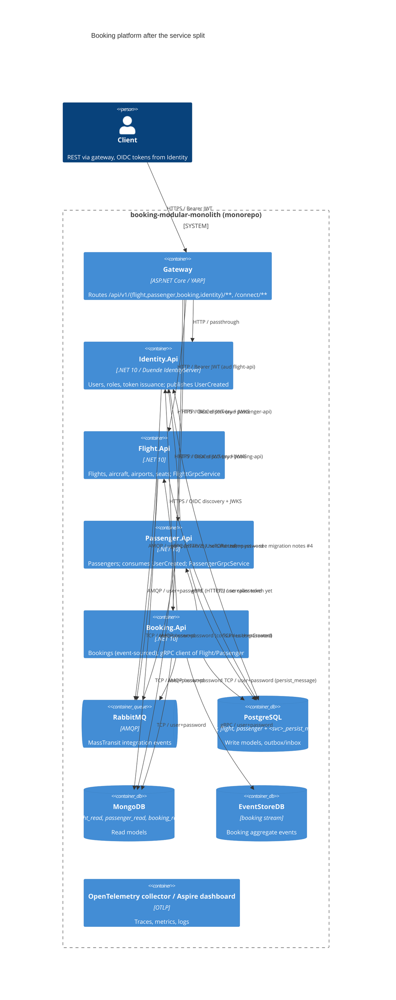

# 0001. Split the booking modular monolith into four services behind a YARP gateway

- **Status:** Proposed
- **Date:** 2026-09-28
- **ARB ticket:** TO BE CREATED
- **Authors:** Abhay Aggarwal (requester), Devin (draft)
- **Owning team:** TBD — owner to confirm before ARB (currently the booking-modular-monolith maintainers)
- **Related ADRs:** none (first ADR in this repository)

## Context

`booking-modular-monolith` hosts four bounded contexts (Identity, Flight, Passenger, Booking) as separate assemblies
inside one ASP.NET Core process (`src/Api`). They already communicate through MassTransit integration events (in-memory
transport), a persisted outbox/inbox and gRPC (loopback), and share one PostgreSQL server, one MongoDB read database,
one EventStoreDB and one persist-message database. The team wants to be able to deploy, scale and test each context
independently without leaving the monorepo, and without yet committing to distributed transactions (sagas).

This change scaffolds that split: each module becomes a self-contained host under `src/Services/<Module>.Api`,
`src/Api` becomes a YARP gateway that preserves the public REST route shapes, MassTransit switches to RabbitMQ, the
non-Identity services become JWT resource servers, and Aspire / docker-compose orchestrate the resulting topology.
Saga orchestration is explicitly deferred; the in-process assumptions that break are catalogued in
`docs/microservices-migration.md`.

ARB triggers: **T1** (four new deployable services + gateway), **T2** (per-service databases: `<service>_persist_message`
Postgres, `flight_read`/`passenger_read`/`booking_read` Mongo — same data, new placement), **T4** (RabbitMQ becomes the
cross-context transport; Booking→Flight/Passenger gRPC crosses a network boundary; event and gRPC contracts are
unchanged), **T6** (per-service JWT audiences validated against Identity; gRPC ports exposed on the container network),
**T7** (none — .NET 10 was already the runtime), **T3** (none — RabbitMQ, YARP, Aspire were already dependencies;
Kibana/Grafana containers are pre-existing in the AppHost).

## Decision

We will host each bounded context as its own ASP.NET Core minimal-API process (`Identity.Api`, `Flight.Api`,
`Passenger.Api`, `Booking.Api`) sharing `src/BuildingBlocks` and a common `ServiceDefaults.AddServiceHost` bootstrap;
route all public traffic through a YARP gateway in `src/Api` that keeps the existing `/api/v1/{context}/...` routes;
move integration events to RabbitMQ via MassTransit with a per-service outbox/inbox; keep Booking→Flight/Passenger on
the existing gRPC contracts, addressed by configuration/service discovery; and have Flight, Passenger and Booking
validate JWTs issued by Identity (Duende IdentityServer remains only in Identity). Saga/compensation logic is out of
scope for this decision and will be a follow-up ADR.

## Alternatives considered

| Alternative | Pros | Cons | Why rejected |
| --- | --- | --- | --- |
| Do nothing (keep the modular monolith) | Simplest ops, single deploy, in-process consistency | Cannot scale/deploy contexts independently; one runtime failure domain; team coupling on releases | Does not meet the independent-deployability goal |
| Split into separate repositories | Hard ownership boundaries | Loses shared `BuildingBlocks`/contracts versioning, multi-repo CI, harder atomic refactors during migration | Monorepo was an explicit requirement; contracts are still evolving together |
| Keep in-memory transport, only split hosts | No broker to operate | Events would silently stop crossing service boundaries; outbox becomes useless | Not viable — the split requires a real transport |
| Kafka instead of RabbitMQ | Replay, high throughput | New vendor/operational surface, MassTransit rider model differs from current consumer model | RabbitMQ already provisioned in infrastructure compose/Aspire and supported by `BuildingBlocks.MassTransit` |
| API gateway product (Kong/Envoy) instead of YARP | Feature-rich | New external dependency and config language | YARP already a dependency; gateway logic is pure routing today |

## Architecture

## Non-functional requirements

| NFR | Target | How met |
| --- | --- | --- |
| Availability SLO | TBD — owner to confirm before ARB (no SLO defined for the monolith) | Independent hosts; gateway retries via Aspire resilience handler; Polly retry/circuit-breaker on gRPC clients |
| p95 latency | TBD — owner to confirm; expect +1 network hop (gateway) and +1 for Booking→Flight gRPC | HTTP/2 gRPC, service discovery, no extra serialization |
| RPO / RTO | TBD — owner to confirm | Outbox/inbox tables make event delivery at-least-once; RabbitMQ durable queues |
| Peak load | TBD — owner to confirm | Each service scales independently (stateless hosts) |
| Scaling model | Horizontal per service | Stateless hosts; shared broker/databases as before |
| Data retention | Unchanged from monolith | Same schemas; persist-message rows cleaned by existing processor |

## Security & compliance

- **Data classification:** Internal + PII (passenger names, passport numbers, user credentials) — unchanged, now
  spread across service-owned databases.
- **Encryption at rest:** N/A in local/dev compose (no managed KMS); production placement TBD — owner to confirm.
- **Encryption in transit:** TLS on gateway and service HTTPS endpoints locally/Aspire; plain HTTP/AMQP inside the
  docker-compose network (pre-existing posture). gRPC between Booking and Flight/Passenger is plaintext HTTP/2 in
  compose (`:81`).
- **AuthN / AuthZ:** Duende IdentityServer in Identity issues JWTs; each service validates issuer, its own audience
  (`flight-api`, `passenger-api`, `booking-api`, `identity-api`) and scope via `BuildingBlocks.Jwt`. Clients must
  request all needed scopes. Service-to-service gRPC does **not** yet forward the caller token and gRPC endpoints are
  anonymous — compensating control is that gRPC ports are only reachable on the compose/Aspire network. Flagged as
  follow-up in `docs/microservices-migration.md` (#4).
- **Secrets:** Connection strings and broker credentials in `appsettings*.json` / Aspire-injected environment, same as
  before; default dev credentials only. Production secret store TBD — owner to confirm.
- **Audit logging:** Serilog structured logs + OpenTelemetry traces per service; correlation id propagated by the
  gateway; W3C trace context now also survives the persisted outbox hop.
- **Data residency / regions:** N/A — local/compose/Aspire only; no cloud region defined in this repo.
- **Policy sections satisfied:** N/A — repository has no `policy/approved-infra.yaml`; no cloud IaC in this change.
- **Threats considered:** token replay across services (mitigated by per-service audience), unauthenticated
  east-west gRPC (open, see above), duplicate `UserCreated` delivery (inbox dedupe; consumer idempotency to harden),
  seat reserved without booking on network failure (saga follow-up).

## Cost

| Item | Assumption | Monthly estimate |
| --- | --- | --- |
| Additional service hosts | 4 services + gateway replacing 1 monolith process; local/compose only today | TBD — owner to confirm before ARB |
| RabbitMQ | Already provisioned in `docker-compose.infrastructure.yaml` and Aspire | $0 incremental in dev |
| Additional databases | Logical databases on the existing Postgres/Mongo servers | $0 incremental in dev |
| **Total** | No cloud footprint defined in repo | TBD (< $2k/mo expected for dev/staging) |

## Operations

- **On-call rotation:** TBD — owner to confirm before ARB.
- **Runbook:** `docs/microservices-migration.md` (ports, config, start order) — to be promoted to a runbook.
- **Dashboards / alarms:** Aspire dashboard (`:18888`), Grafana/Prometheus/Jaeger containers from AppHost; per-service
  `/health` endpoints. Alarms TBD.
- **Rollback plan:** Revert the PR — the monolith `src/Api` host and module projects are restored. The split uses new
  database names (`<svc>_service`, `<svc>_persist_message`, `<svc>_read`), so the monolith databases are left untouched
  and rollback needs no data migration; anything written to the new databases while the split was live is abandoned.
- **Data cut-over:** No production data exists for this repo today. For a real environment the cut-over step is:
  stop writes, `pg_dump`/`pg_restore` each monolith write database into its `<svc>_service` counterpart (schemas are
  identical), let each service rebuild its `<svc>_read` Mongo projection from the write side / EventStore stream, and
  start with empty outbox tables. This must be executed before step 2 of the migration plan below.
- **Migration / cut-over plan:** 1) merge scaffold (this change), 2) run services side-by-side behind the gateway,
  3) harden the flagged boundaries (idempotent consumers, token forwarding on gRPC), 4) saga ADR for
  Booking↔Flight seat reservation, 5) retire shared-database assumptions.

## Policy exceptions requested

| Rule | Resource | Justification | Compensating control | Expiry |
| --- | --- | --- | --- | --- |
| none | | | | |

## Consequences

- Positive: independent deploy/scale/test per bounded context; explicit contracts (RabbitMQ events, gRPC) with
  contract tests pinning them; trace context end-to-end across broker and gRPC.
- Negative / risks: at-least-once delivery semantics now visible to consumers; Booking→Flight seat reservation is not
  transactional; more processes to run locally (mitigated by Aspire AppHost); east-west gRPC is unauthenticated until
  token forwarding is added.
- Follow-ups: saga/compensation ADR; gRPC auth forwarding; idempotent `UserCreated` consumer; production
  placement/NFR numbers; retire per-module `booking-modular-monolith` audience.

## Open questions

- Owning team, on-call and SLO/RPO/RTO targets for each service.
- Production hosting target (Kubernetes manifests in `deployments/` still describe the monolith).
- Whether Booking should project Flight/Passenger data from events instead of synchronous gRPC reads.
