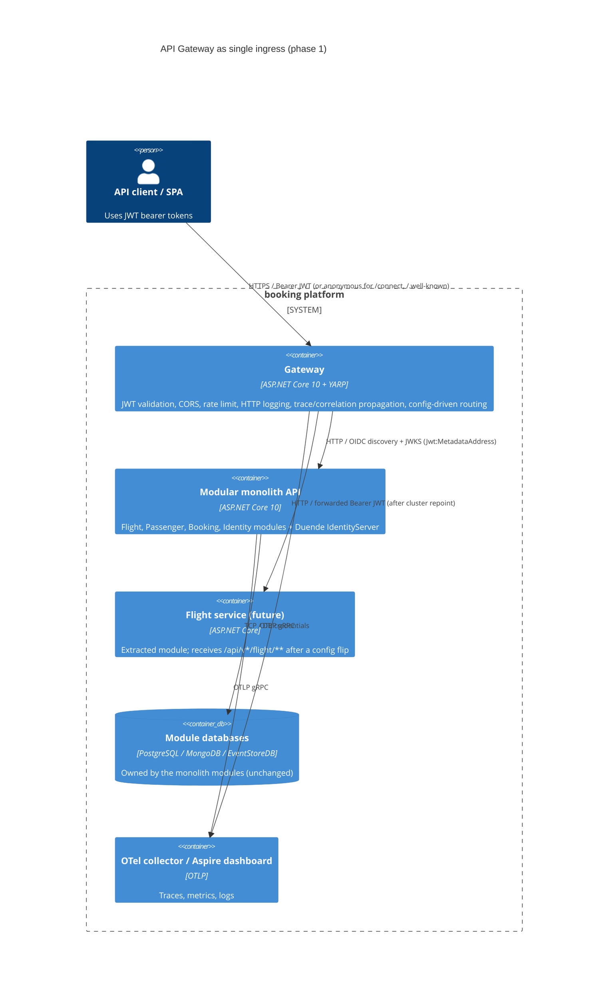

# 6. API Gateway (YARP) as the single ingress

- **Status:** Proposed
- **Date:** 2026-09-28
- **ARB ticket:** TO BE CREATED
- **Authors:** Devin (for AB-234)
- **Owning team:** Booking platform team (owners of `booking-modular-monolith`)
- **Related ADRs:** 0002 Strangler-fig migration (proposed in PR #70; this ADR implements its "single ingress" step)

## Context

`booking-modular-monolith` exposes Flight, Passenger, Booking and Identity modules from one ASP.NET Core
host (`src/Api`) that also hosts Duende IdentityServer. Jira AB-230/AB-231 plan a strangler-fig
migration in which modules are extracted into independently deployable services one at a time.
Today clients talk to the monolith directly, so every extraction would be a client-visible change.

`Yarp.ReverseProxy` is already referenced by `BuildingBlocks` but no gateway exists. AB-234 asks for a
gateway host that (1) initially forwards everything to the monolith, (2) centralises JWT validation,
CORS, rate limiting and request logging/trace propagation, and (3) makes per-module route
destinations config-driven so repointing `/api/v1/flight/**` to a Flight service is a config-only change.

Constraints: .NET 10 / Aspire 13 stack; reuse `BuildingBlocks/Jwt`; IdentityServer stays inside the
monolith for now, so the gateway must pass `/connect/*` and `/.well-known/*` through anonymously;
no new cloud infrastructure (runs as one more container in docker-compose and one more project in
the Aspire AppHost).

ARB triggers: T1 (new deployable service: `src/Gateway`, new compose service and Dockerfile),
T6 (new public ingress / authentication boundary — JWT is now validated at the edge),
T8 (small change to shared `BuildingBlocks.Jwt`: optional `MetadataAddress`). Detector hits on T3
(`json.schemastore.org` in `launchSettings.json`, a test-only CORS origin) and T7 (`dotnet/sdk:10.0`,
same runtime the monolith already uses) are false positives.

## Decision

We will add `src/Gateway`, an ASP.NET Core host using YARP, as the only client-facing entry point.
All YARP routes and clusters live in configuration (`ReverseProxy` section, overridable per
environment / via `ReverseProxy__Clusters__<module>__Destinations__monolith__Address`). Each
module (`flight`, `passenger`, `booking`, `identity`) has its own cluster whose single destination is
the monolith; a low-priority `monolith-fallback` route catches everything else (Swagger, health,
IdentityServer UI). The gateway terminates JWT validation with `BuildingBlocks.Jwt.AddJwt()` and
enforces the existing `ApiScope` policy on module routes, applies a per-client-IP fixed-window rate
limit, a config-driven CORS policy, ASP.NET HTTP logging, and forwards `Authorization`,
`correlationId` and W3C `traceparent` headers downstream. The monolith keeps its own JWT validation
(defence in depth); nothing in `src/Api` changes except an explicit `AuthOptions.IssuerUri`.

## Alternatives considered

| Alternative | Pros | Cons | Why rejected |
| --- | --- | --- | --- |
| Do nothing (clients call the monolith directly) | No new component | Every module extraction is a client-visible URL/auth change; no central place for rate limiting/CORS | Blocks the strangler-fig migration (AB-230) |
| Cloud/managed gateway (e.g. AWS API Gateway, Azure APIM, Kong) | Managed scaling, WAF, analytics | New infra and cost; config drift between local (compose/Aspire) and cloud; slow inner loop; YARP already a dependency | Premature for phase 1; can front YARP later if needed |
| Reuse `Microsoft.AspNetCore.Ocelot` / nginx / Envoy | Mature proxies | Ocelot is not maintained for .NET 10; nginx/Envoy cannot reuse `BuildingBlocks.Jwt`, Aspire service discovery or OTel setup | YARP keeps auth/observability code in one language and one package set |
| Put YARP inside the monolith host | No extra process | Gateway cannot outlive the monolith it is meant to strangle; couples deployments | Defeats the purpose |

## Architecture

## Non-functional requirements

| NFR | Target | How met |
| --- | --- | --- |
| Availability SLO | Same as the monolith today (TBD — owner to confirm before ARB); gateway must not lower it | Stateless process; runs beside the monolith; can be scaled horizontally; health at `/health`, `/alive` via ServiceDefaults |
| p95 latency | < 5 ms added per hop (TBD — owner to confirm) | YARP is in-process forwarding; JWKS cached by the JWT handler; no I/O beyond the proxied call |
| RPO / RTO | RPO N/A (no state); RTO = container restart (< 1 min) | No data store; all state is config |
| Peak load | TBD — owner to confirm; default rate limit 100 req/s per client IP | `RateLimitOptions` config, `429` on excess |
| Scaling model | Horizontal, stateless replicas behind the existing load balancer | No sticky sessions; JWT validation is stateless |
| Data retention | N/A — the gateway stores nothing; logs follow existing log pipeline retention | HTTP logging emits method/path/status/duration only (no bodies, no `Authorization`) |

## Security & compliance

- **Data classification:** Internal/confidential passenger and booking data transits the gateway; bearer tokens (secret) are forwarded, never logged.
- **Encryption at rest:** N/A — no storage.
- **Encryption in transit:** TLS at the client edge (Kestrel HTTPS locally via `launchSettings`/Aspire; TLS termination in front of the container in shared environments). Gateway→monolith is plain HTTP inside the private compose/Aspire network — same posture as inter-container traffic today; TBD for production networks (owner to confirm mTLS/service-mesh requirement).
- **AuthN / AuthZ:** JWT bearer via `BuildingBlocks.Jwt` (issuer, audience, lifetime, signature validated; `Authority` = IdentityServer in the monolith). Module routes and any other `/api/*` path (`api-fallback`) require the `ApiScope` policy; `/connect/*`, `/.well-known/*` and the non-API fallback are anonymous so token issuance/discovery/Swagger keep working. Downstream services still validate the token (defence in depth); fine-grained role policies stay in the modules.
- **Secrets:** None introduced. JWT config is authority/audience only (non-secret). Dev HTTPS certs are the existing self-signed ones.
- **Audit logging:** Structured HTTP logs (method, path, query, status, duration) per request with `correlationId`; OpenTelemetry traces exported via the existing collector.
- **Data residency / regions:** Unchanged — deploys wherever the monolith deploys.
- **Policy sections satisfied:** no new cloud resources; reuses approved container runtime and existing OTel pipeline.
- **Threats considered:** token replay (mitigated by short-lived tokens + lifetime validation), header spoofing of `correlationId` (accepted: informational only), DoS (per-IP fixed-window rate limit; tune `RateLimitOptions`; behind a load balancer register it in `TrustedProxyOptions` so the limiter keys on `X-Forwarded-For`), CORS misconfiguration (default allows any origin without credentials; set `CorsOptions:AllowedOrigins` in shared environments), open-proxy risk (routes are an explicit allow-list; no wildcard host forwarding).

## Cost

| Item | Assumption | Monthly estimate |
| --- | --- | --- |
| Gateway container | 1–2 replicas, 0.25 vCPU / 256 MB each, on the same compute the monolith already uses | ≈ $10–30 (TBD — owner to confirm against actual hosting) |
| Additional egress / observability volume | One extra span + one log line per request | negligible |
| **Total** | | < $50 / month (well under the $2k flag) |

## Operations

- **On-call rotation:** Same rotation as `booking-modular-monolith` (TBD — owner to confirm).
- **Runbook:** `README.md` → "API Gateway" section (run, repoint a module, disable rate limit). Dedicated runbook TBD before production rollout.
- **Dashboards / alarms:** Existing Grafana/Aspire dashboards pick up the new `booking_gateway` OTel source; alarm on gateway 5xx rate and 429 rate (TBD).
- **Rollback plan:** Point clients back at the monolith URL (ports unchanged: 3000/3001) and stop the gateway container; or revert a single cluster destination in config to restore monolith routing for one module.
- **Migration / cut-over plan:** Phase 1 (this ADR): gateway in front, all clusters → monolith. Phase 2+: per module, deploy the extracted service, flip `ReverseProxy:Clusters:<module>:Destinations:monolith:Address` (or add a second destination and shift traffic), observe, then remove the module from the monolith.

## Policy exceptions requested

| Rule | Resource | Justification | Compensating control | Expiry |
| --- | --- | --- | --- | --- |
| none | | | | |

## Consequences

- Positive: clients get one stable URL; module extraction becomes a config change; ingress concerns (auth, CORS, rate limit, logging) are defined once.
- Negative / risks: one more process to run and monitor; an extra network hop; the gateway is a new single point of failure unless replicated; the monolith's IdentityServer must be reachable from the gateway for JWKS.
- Follow-ups: create the ARB ticket; confirm NFR/ownership TBDs; add gateway to CI image build; decide whether client-side `Authorization` should be stripped once downstream services trust the gateway (not now).

## Open questions

- Availability SLO, peak load, and hosting cost baseline for the monolith (owner to confirm).
- Is gateway→service traffic required to be TLS/mTLS in shared environments?
- Should IdentityServer be extracted first (so the gateway does not depend on the monolith for JWKS), contrary to the Flight-first order in ADR 0002?
