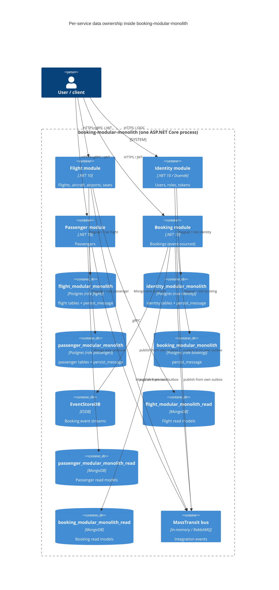

# 0006. Per-service database and outbox/inbox isolation

- **Status:** Proposed
- **Date:** 2026-09-28
- **ARB ticket:** TO BE CREATED
- **Authors:** Devin (for Abhay Aggarwal)
- **Owning team:** booking-modular-monolith maintainers (COG-GTM)
- **Related ADRs:** [0004 Data ownership: database per service](0004-data-ownership.md) (target state this ADR implements, AB-230), [0001 Service boundaries](0001-service-boundaries.md)

## Context

The modular monolith already uses one Postgres database per write module (`flight_*`, `identity_*`,
`passenger_*`) and EventStoreDB for Booking, but three pieces of persistence were still shared across
modules and block extracting any module into a standalone service ([AB-236](https://cog-gtm.atlassian.net/browse/AB-236),
Phase 1 of [AB-231](https://cog-gtm.atlassian.net/browse/AB-231)):

1. a single `persist_message` outbox/inbox database (`PersistMessageDbContext`) written by every module,
2. a single MongoDB read database (`booking_modular_monolith_read`) holding every module's read models,
3. one Postgres role (`postgres`) with access to every module database.

Constraints: no change to public HTTP/gRPC contracts or integration events; the application still runs as
one process; local development keeps using one Postgres server and one MongoDB server (Aspire / docker-compose).

ARB triggers: T2 (changed data stores — one new logical Postgres database `booking_modular_monolith`,
`persist_message` moves into each module database, Mongo read data split into three logical databases,
per-service Postgres roles). T1 flagged by the detector on `docker-compose.yaml` is a bind-mount of an
init script into the existing Postgres container, not a new deployable. No new vendor, framework, auth
boundary or cross-domain contract is introduced.

## Decision

We will make every module the sole owner of its stores: each module registers its own
`PersistMessageDbContext<TModule>` / `IPersistMessageProcessor<TModule>` / `IEventDispatcher<TModule>` /
background processor bound to the module's own Postgres connection, so the outbox/inbox table lives inside
the module database (Booking gets a new `booking_modular_monolith` database for this); each Mongo read
context is bound to a module-named `MongoOptions:{Module}` section and Aspire `{module}-read` database;
each module connects with its own Postgres role (`flight`, `identity`, `passenger`, `booking`) that owns
only its database. No module-agnostic `IPersistMessageProcessor`, `IEventDispatcher` or Mongo database
name is registered any more, so a module cannot reach another module's data through DI.

## Alternatives considered

| Alternative | Pros | Cons | Why rejected |
| --- | --- | --- | --- |
| Do nothing (keep shared `persist_message` and read DB) | Zero change | Shared outbox is the main coupling blocking extraction (AB-238..241); cross-module data access stays possible | Contradicts ADR 0004 |
| Per-module *schemas* inside one shared Postgres database | Fewer databases to provision | Still one database/credential; a schema-per-module split has to be undone again at extraction time; cross-schema joins remain possible | ADR 0004 requires logical DB + credentials per service |
| Separate `persist_message` database per module (4 extra databases) | Outbox isolated from business data | Loses the single local transaction between business tables and outbox rows (`TransactionScope` would need distributed transactions) and doubles the databases to manage | Outbox inside the module DB is the standard outbox pattern and keeps writes atomic |
| Separate Postgres/Mongo *servers* per module now | Strongest isolation | Considerable local/CI cost for no additional ownership guarantee at this phase | ADR 0004 explicitly allows one cluster with per-service logical DBs/credentials; server split can happen at extraction (AB-238..241) |

## Architecture

Each module's `PersistMessageBackgroundService<TModule>` reads only that module's `persist_message` table and
publishes to the bus; consumers write inbox rows into the consuming module's table (`ConsumeFilter<TConsumer,TMessage>`
resolves the store through the consumer's module assembly).

## Non-functional requirements

| NFR | Target | How met |
| --- | --- | --- |
| Availability SLO | Unchanged from today (single process, single Postgres/Mongo instance) — TBD, owner to confirm before ARB | No new runtime component; four small polling loops instead of one |
| p95 latency | Unchanged; outbox write is in the same local transaction as before | Outbox row written to the module's own DB inside the existing `TransactionScope` |
| RPO / RTO | Same as existing Postgres/Mongo backups — TBD, owner to confirm | Backup scope now includes `booking_modular_monolith`; no cross-database consistency is required (eventual via outbox) |
| Peak load | Dev/demo workload; unchanged | n/a |
| Scaling model | One process; each module DB can later move to its own server without code changes (connection string only) | Per-module connection names `Flight/Identity/Passenger/Booking` and `{module}-read` |
| Data retention | Processed outbox/inbox rows are retained as today | Existing behaviour |

## Security & compliance

- **Data classification:** Identity DB holds user PII/credentials (unchanged); Passenger DB holds passenger PII (unchanged); outbox rows contain serialized integration events (may contain names/passport numbers) and now live only in the owning module's database instead of one shared table.
- **Encryption at rest:** local docker volumes, none (unchanged); production: TBD — owner to confirm.
- **Encryption in transit:** local dev plain TCP (unchanged); production connection strings should set `SSL Mode=Require` — TBD.
- **AuthN / AuthZ:** one Postgres role per module, each owning exactly its database; `CONNECT` on every module DB revoked from `PUBLIC` (`deployments/docker-compose/init/postgres/01-service-databases.sql`). Application auth unchanged. Aspire local orchestration (`postgres.AddDatabase`) provisions the logical databases only and connects with the server credential; role-level isolation is enforced by the compose init script locally and by per-role credentials in deployed environments.
- **Secrets:** dev credentials live in `appsettings.json` / Aspire parameters as before; production credentials must come from the deployment secret store per role.
- **Audit logging:** unchanged (Serilog / OpenTelemetry).
- **Data residency / regions:** unchanged.
- **Policy sections satisfied:** ADR 0004 "logical databases/credentials strictly per service".
- **Threats considered:** cross-module data access via shared credential (removed); a module reading another module's outbox (removed — no shared `IPersistMessageProcessor`).

## Cost

| Item | Assumption | Monthly estimate |
| --- | --- | --- |
| Additional Postgres logical database + roles | same server, no extra instance | $0 |
| Additional Mongo logical databases | same server | $0 |
| Three additional outbox pollers (30 s interval) | negligible CPU | $0 |
| **Total** | | $0 incremental (< $500, no ARB_LIGHT threshold reached) |

## Operations

- **On-call rotation:** repository maintainers (COG-GTM) — no change.
- **Runbook:** `README.md` (run via Aspire AppHost or `deployments/docker-compose`); first start of an empty Postgres volume runs the init SQL that creates roles/databases. Existing volumes must be recreated or the SQL applied manually.
- **Dashboards / alarms:** existing OpenTelemetry/Aspire dashboard; each `PersistMessageBackgroundService<TModule>` logs start/stop per module.
- **Rollback plan:** revert the PR; the previous shared `persist_message` database is untouched by this change. Unprocessed outbox rows written to module databases after cut-over would need to be re-published manually.
- **Migration / cut-over plan:** dev/test only at this phase; Booking's database and all `persist_message` tables are created on first use (`EnsureCreated` / `CREATE TABLE IF NOT EXISTS`); module schemas continue to use EF migrations.

## Policy exceptions requested

| Rule | Resource | Justification | Compensating control | Expiry |
| --- | --- | --- | --- | --- |
| none | | | | |

## Consequences

- Positive: each module (and its outbox/inbox) can be lifted into a standalone host (AB-238..AB-241) by changing connection strings only; no cross-module DI path to another module's store exists; tests exercise per-module stores on one Testcontainers Postgres.
- Negative / risks: four pollers instead of one; existing local Postgres volumes need the new roles/databases; Booking now has a small Postgres database solely for its outbox.
- Follow-ups: per-service Postgres/Mongo servers when services are extracted; `ConsumeFilter` is wired per consumer when inbox de-duplication is enabled.

## Open questions

- Production availability/RPO/RTO/encryption targets are unchanged by this ADR but were never recorded — owner to confirm before ARB.
