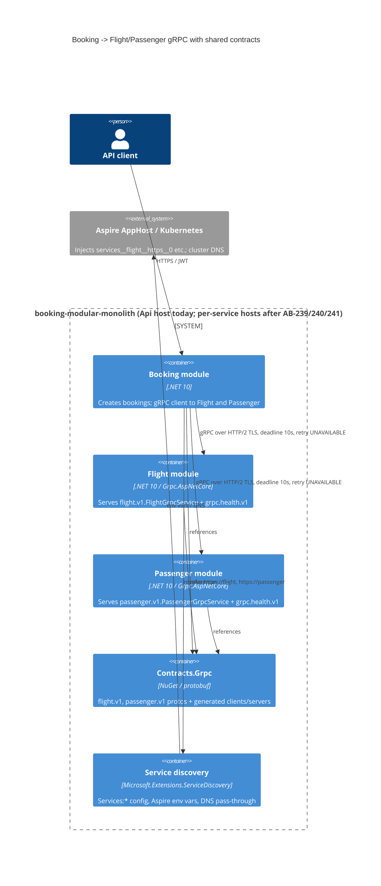

# 0007. Shared, versioned gRPC contracts and discovery-based service addressing

- **Status:** Proposed
- **Date:** 2026-09-30
- **ARB ticket:** TO BE CREATED
- **Authors:** Booking platform (via Devin, ticket [AB-237](https://cog-gtm.atlassian.net/browse/AB-237))
- **Owning team:** Booking platform team (owners of `src/Modules/*` and `src/BuildingBlocks`)
- **Related ADRs:** 0003 (inter-service communication: gRPC sync), 0005 (contract versioning policy) — both from AB-230

## Context

Booking calls Flight and Passenger over gRPC. The `.proto` files were duplicated (a client copy in
`src/Modules/Booking/src/GrpcClient/Protos` and a server copy in each module's `GrpcServer/Protos`)
and the client channel addresses were plain strings in `Booking.Configuration.GrpcOptions`
(`FlightAddress`, `PassengerAddress`). Both are blockers for running the modules as independently
deployable services (AB-231): there is no single source of truth for the wire contract, and the
client cannot find Flight/Passenger once they leave the process.

Constraints: .NET 10, gRPC (`Grpc.AspNetCore`, `Grpc.Net.ClientFactory`), .NET Aspire for local
orchestration, `Microsoft.Extensions.ServiceDiscovery` and `Microsoft.Extensions.Http.Resilience`
already used by `ServiceDefaults`. The modules still run in one process (`Api`) until the host split
tickets (AB-239/240/241) land, so the change must work in-process today and cross-process later
without further code changes.

ARB triggers: T4 (new shared schema / cross-domain sync contract: `Contracts.Grpc` `flight.v1`,
`passenger.v1`), T8 (new shared library: `Contracts.Grpc` package and `BuildingBlocks.Grpc`
component used by more than one module). The triage detector also flagged T3 on a test string
(`https://passenger.booking.svc.cluster.local`); this is an in-cluster DNS name in a unit test, not
a new external vendor, and is discounted.

## Decision

We will publish the Flight and Passenger gRPC contracts from a single project, `src/Contracts.Grpc`
(NuGet id `Contracts.Grpc`, SemVer, proto packages `flight.v1` / `passenger.v1`, C# namespaces
`Contracts.Grpc.Flight.V1` / `Contracts.Grpc.Passenger.V1`), referenced by the Flight and Passenger
servers and the Booking client; delete all module-local protos. Booking addresses Flight and Passenger
by logical service URI (`https://flight`, `https://passenger`) that `Microsoft.Extensions.ServiceDiscovery`
resolves from configuration (`Services:<name>:https:0`), Aspire-injected environment variables
(`services__<name>__https__0`) or, as a pass-through, cluster DNS. A shared `BuildingBlocks.Grpc`
component gives every gRPC client a default deadline, gRPC-native retries on `UNAVAILABLE`, an HTTP/2
`SocketsHttpHandler` (TLS by default, opt-in to accept self-signed certificates in dev), and layers on
the host's standard Polly resilience handler (retry, circuit breaker, timeouts). Each provider exposes
the standard `grpc.health.v1` service and Booking registers readiness checks against it, so a host
is only "ready" when its gRPC dependencies are serving.

## Alternatives considered

| Alternative | Pros | Cons | Why rejected |
| --- | --- | --- | --- |
| Do nothing (keep duplicated protos and address strings) | zero effort | contracts drift silently; no way to run Booking out of process; blocks AB-239/240/241 | does not meet AB-237 acceptance criteria |
| Keep duplicated protos but add a CI diff check | small change | still two sources of truth; different `package` names generate different C# types, so client/server cannot share fakes or tests | still duplicated; violates ADR 0005 |
| Separate `Contracts.Flight` / `Contracts.Passenger` packages | finer-grained ownership and release cadence | more projects/pipelines for two protos; both are owned by the same team today | premature; can be split later without changing proto packages |
| Hard-code Kubernetes DNS names (`flight.booking.svc.cluster.local`) in appsettings | trivial | environment-specific values in code; no local Aspire story; no TLS/http fallback | fails "config/discovery-driven" requirement |
| gRPC client-side load balancing (`dns:///` + `Grpc.Net.Client` balancer) instead of `Microsoft.Extensions.ServiceDiscovery` | native gRPC picker/sub-channels | no Aspire integration; a second discovery mechanism next to the one ServiceDefaults already uses for HTTP | consistency with existing platform component |

## Architecture

## Non-functional requirements

| NFR | Target | How met |
| --- | --- | --- |
| Availability SLO | TBD — owner to confirm before ARB (inherits current Api SLO) | retries on `UNAVAILABLE`, circuit breaker via standard resilience handler, readiness gating |
| p95 latency | Booking→Flight/Passenger call ≤ 10 s hard deadline (default `GrpcClientOptions.Deadline`) | `GrpcClientDeadlineInterceptor` sets a deadline on every call without one |
| RPO / RTO | N/A — no new data store | |
| Peak load | TBD — owner to confirm before ARB; unchanged from today (same call volume, in-process → network) | HTTP/2 multiplexing, `EnableMultipleHttp2Connections`, keep-alive pings |
| Scaling model | horizontal; one channel per client per host, endpoints re-resolved by service discovery | `Microsoft.Extensions.ServiceDiscovery` watcher + Aspire/K8s DNS |
| Data retention | N/A — no data stored | |

## Security & compliance

- **Data classification:** Internal — flight/seat availability and passenger identifiers (passenger id, name) already exchanged in-process today; now crosses the network within the trust boundary.
- **Encryption at rest:** N/A — no persistence added.
- **Encryption in transit:** TLS 1.2+ (Kestrel HTTPS endpoint, `https://` logical addresses by default). `AcceptAnyServerCertificate` is opt-in per environment for dev certificates only; docker-compose routes gRPC over the container's HTTPS endpoint with the mounted dev certificate and `AcceptAnyServerCertificate=true` (`appsettings.docker.json`) because Kestrel only negotiates cleartext HTTP/2 on HTTP/2-only endpoints.
- **AuthN / AuthZ:** Unchanged — internal gRPC endpoints are not exposed through the API gateway; service-to-service auth (mTLS/JWT propagation) is out of scope and tracked as an open question.
- **Secrets:** None added. Addresses are non-secret configuration.
- **Audit logging:** Existing OpenTelemetry gRPC client/server instrumentation and correlation-id middleware cover the calls.
- **Data residency / regions:** Unchanged.
- **Policy sections satisfied:** no new infrastructure; `policy/approved-infra.yaml` not applicable (repo has none).
- **Threats considered:** endpoint spoofing (mitigated by TLS with validated certificates in non-dev), retry storms (bounded by `MaxAttempts` and exponential backoff, deadline caps total time), self-dependency deadlock in health (gRPC health service excludes outbound gRPC dependency checks).

## Cost

| Item | Assumption | Monthly estimate |
| --- | --- | --- |
| Compute / network | no new resources; same hosts, in-cluster traffic | $0 |
| Package hosting | `Contracts.Grpc` built from the same repo/solution; no external feed added | $0 |
| **Total** | | $0 (< $500/mo threshold) |

## Operations

- **On-call rotation:** Booking platform team (existing Api rotation).
- **Runbook:** `src/Contracts.Grpc/README.md` (contract change rules); addressing config documented in `src/Api/src/appsettings*.json` (`Grpc`, `Services` sections).
- **Dashboards / alarms:** existing OpenTelemetry gRPC metrics/traces (Aspire dashboard, Prometheus); `/health` now includes `flight` and `passenger` readiness checks tagged `ready`.
- **Rollback plan:** revert the PR; no data or infra migration involved.
- **Migration / cut-over plan:** phase 1 (this ADR) — shared contracts + discovery in the monolith host (addresses point to the host itself). Phase 2 (AB-239/240/241) — per-service hosts; only `Services:*` config / Aspire references change, no code change in Booking.

## Policy exceptions requested

| Rule | Resource | Justification | Compensating control | Expiry |
| --- | --- | --- | --- | --- |
| none | | | | |

## Consequences

- Positive: one proto source per service; identical generated types on both sides; Booking is host-agnostic; deadlines/retries are explicit and configurable; readiness reflects dependency health.
- Negative / risks: `Contracts.Grpc` is a shared dependency — breaking proto changes require a `v2` package per ADR 0005; the `grpc.health.v1` endpoint is reachable by any caller that can reach the gRPC port (internal only).
- Follow-ups: publish `Contracts.Grpc` to the internal NuGet feed once services live in separate repos; add `buf breaking` CI check (ADR 0005); wire per-service Aspire references in AB-239/240/241; decide service-to-service authentication.

## Open questions

- Availability SLO and expected peak RPS for Booking→Flight/Passenger — owner to confirm.
- Service-to-service authentication (mTLS vs. propagated JWT) for the gRPC ports once cross-process.
