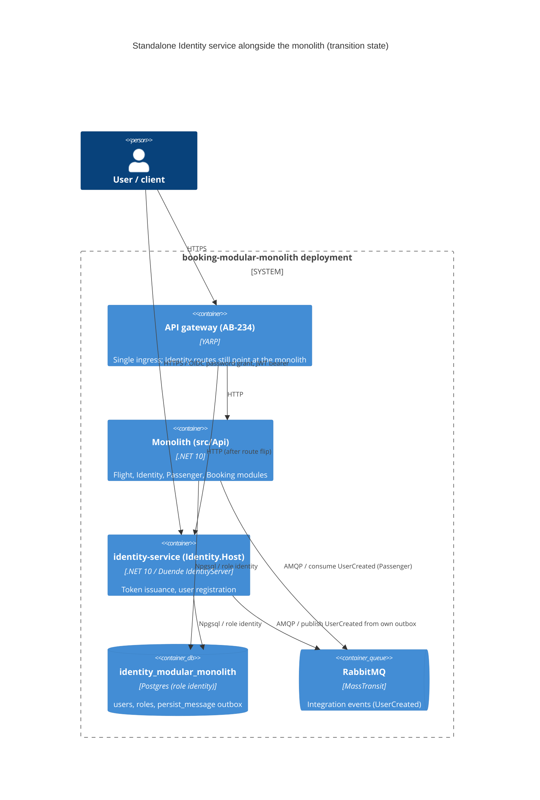

# 0007. Standalone Identity service host

- **Status:** Proposed
- **Date:** 2026-10-06
- **ARB ticket:** TO BE CREATED
- **Authors:** Devin (for Abhay Aggarwal)
- **Owning team:** booking-modular-monolith maintainers (COG-GTM)
- **Related ADRs:** [0001 Service boundaries](0001-service-boundaries.md), [0002 Strangler-fig migration](0002-strangler-fig-migration.md), [0003 Inter-service communication](0003-inter-service-communication.md), [0004 Data ownership](0004-data-ownership.md), [0005 Contract versioning](0005-contract-versioning.md), [0006 Per-service database and outbox isolation](0006-per-service-database-and-outbox-isolation.md)

## Context

The Identity module (`src/Modules/Identity`) is composed into the monolith host (`src/Api`) through
`AddIdentityModules()` / `UseIdentityModules()` and hosts Duende IdentityServer, ASP.NET Core Identity
(users/roles in Postgres via `IdentityContext`) and the `register-user` endpoint that emits the
`UserCreated` integration event consumed by Passenger.

Phase 2 of the microservices migration epic ([AB-231](https://cog-gtm.atlassian.net/browse/AB-231)) needs each
module to be deployable on its own ([AB-238](https://cog-gtm.atlassian.net/browse/AB-238) for Identity).
The prerequisites are in flight: versioned `Contracts.Messages` package (AB-232), BuildingBlocks split into
independently consumable libraries (AB-233), RabbitMQ transport for MassTransit (AB-235) and per-module
database + outbox/inbox (AB-236, ADR 0006).

Constraints: strangler-fig (ADR 0002) — the monolith keeps composing Identity and must keep working;
no change to Identity's HTTP endpoints, token endpoints or the `UserCreated` contract; other teams are
scaffolding the Flight/Passenger/Booking hosts in parallel, so shared files change minimally.

ARB triggers: **T1** new deployable service (`identity-service`, `src/Services/Identity`, Dockerfile and
docker-compose override); **T6** a second process can now issue tokens and exposes the OIDC/token endpoints
and `/api/v1/identity/*` on its own port (5103 locally); **T4** `UserCreated` is now published across a
process boundary over RabbitMQ (contract unchanged, transport per ADR 0003). No new data store (the host uses
the existing `identity_modular_monolith` database and its `persist_message` outbox from ADR 0006), no new
vendor, no framework change.

## Decision

We will add an `Identity.Host` ASP.NET Core project (`src/Services/Identity/src`) that composes only the
Identity module — its minimal endpoints, DI, `IdentityContext` with EF migrations and seeding, Duende
IdentityServer, and its typed outbox (`PersistMessageProcessor<IdentityRoot>`) — plus service defaults
(health checks, OpenTelemetry, service discovery), JWT bearer validation and MassTransit over RabbitMQ
registered with the Identity assembly only. It references only the Identity module, `ServiceDefaults`,
the BuildingBlocks libraries it needs (Core, EFCore, Jwt, Web, MassTransit) and `Contracts.Messages`; it
references no other module. The host composition lives inside the host project (no new shared library).
The monolith continues to compose Identity unchanged until the gateway route for Identity is flipped
(ADR 0002); this ADR does not flip any route.

## Alternatives considered

| Alternative | Pros | Cons | Why rejected |
| --- | --- | --- | --- |
| Do nothing (Identity only in the monolith) | No new deployable | Identity cannot be scaled, deployed or released independently; blocks the AB-231 target architecture | Contradicts ADR 0001/0002 |
| Shared `ServiceHost` library used by all four service hosts | One place for host composition | New shared platform component (T8) and a merge hotspot while four hosts are built in parallel; couples service release cadence again | Can be extracted later once all hosts exist and their composition is proven identical |
| Move Identity code out of `src/Modules/Identity` into the new service | Clean final layout | Breaks the monolith during the transition; big-bang move | ADR 0002 keeps the module in the monolith until cut-over; the host references the module project instead |
| Replace Duende IdentityServer with an external IdP during extraction | Removes self-hosted IdP | New vendor (T3), auth change (T6), client changes | Out of scope; extraction must not change auth behaviour |

## Architecture

## Non-functional requirements

| NFR | Target | How met |
| --- | --- | --- |
| Availability SLO | TBD — owner to confirm before ARB | `/health` (self + RabbitMQ) and `/alive` endpoints from service defaults for orchestrator probes |
| p95 latency | Same as the Identity module in the monolith — TBD numeric target | Same code path; no extra hop until the gateway route is flipped |
| RPO / RTO | Same as the Identity Postgres database — TBD | No new store; outbox gives at-least-once delivery of `UserCreated` |
| Peak load | Dev/demo workload — TBD for production | n/a |
| Scaling model | Single instance until the signing key is externalised (see open questions) | Stateless HTTP; state in Postgres; developer signing key is per instance |
| Data retention | Unchanged | Existing Identity tables and processed outbox rows |

## Security & compliance

- **Data classification:** user PII and password hashes (ASP.NET Core Identity) — unchanged; same database as the module in the monolith.
- **Encryption at rest:** local docker volumes, none (unchanged); production: TBD — owner to confirm.
- **Encryption in transit:** local dev plain HTTP/AMQP/TCP; production must terminate TLS at the gateway/ingress and use TLS for Postgres and RabbitMQ — TBD.
- **AuthN / AuthZ:** Duende IdentityServer (in-memory clients/scopes/resources from `Config`, resource-owner password grant) issues tokens; the host validates its own tokens via `Jwt:Authority` = `AuthOptions:IssuerUri`; `register-user` stays behind the `ApiScope` policy. No new clients or grants.
- **Secrets:** dev credentials in `appsettings*.json` as for the monolith; signing key is `AddDeveloperSigningCredential` (generated `tempkey.jwk`, gitignored). Production must load the signing key and DB/RabbitMQ credentials from the secret store — follow-up.
- **Audit logging:** Serilog/OpenTelemetry via service defaults (unchanged behaviour).
- **Data residency / regions:** unchanged.
- **Policy sections satisfied:** ADR 0001 (one service per module), ADR 0003 (RabbitMQ async), ADR 0004/0006 (own database + outbox, own role).
- **Threats considered:** two independent token issuers during transition (different signing keys/issuers) — clients must only use one issuer per environment, controlled by the gateway route; duplicate `UserCreated` if both processes register users concurrently is not possible for one request, but both outbox pollers read the same `persist_message` table when pointed at the same database (see open questions).

## Cost

| Item | Assumption | Monthly estimate |
| --- | --- | --- |
| One additional container (identity-service) | small .NET container, dev/demo | TBD — owner to confirm (expected < $500) |
| Database / broker | existing Postgres and RabbitMQ | $0 incremental |
| **Total** | | TBD (< $2k/month expected; no T9) |

## Operations

- **On-call rotation:** repository maintainers (COG-GTM).
- **Runbook:** `cd src/Services/Identity/src && dotnet run` (port 5103) against `deployments/docker-compose` infra, or `docker compose -f docker-compose.yaml -f docker-compose.identity-service.yaml up`.
- **Dashboards / alarms:** OpenTelemetry (`identity_service`) to the existing collectors/Aspire dashboard; health endpoints.
- **Rollback plan:** stop/remove the identity-service container; the monolith still serves Identity (routes never flipped by this change).
- **Migration / cut-over plan:** out of scope here — gateway route flip per ADR 0002, after which Identity is removed from the monolith composition.

## Policy exceptions requested

| Rule | Resource | Justification | Compensating control | Expiry |
| --- | --- | --- | --- | --- |
| none | | | | |

## Consequences

- Positive: Identity builds, runs and is tested independently of the other modules; `UserCreated` crosses the process boundary over RabbitMQ; the host is a template for the Flight/Passenger/Booking hosts.
- Negative / risks: host composition is duplicated with `src/Api` until a shared host library is justified; two token issuers exist during the transition.
- Follow-ups: externalise the IdentityServer signing key and configuration stores; gateway route flip; remove Identity from the monolith after burn-in; decide whether to extract a shared service-host library once all four hosts exist.

## Open questions

- Signing key management for multi-instance deployments (Duende licensing/key management vs. external key in secret store).
- While both the monolith and identity-service point at `identity_modular_monolith`, both outbox pollers process the same `persist_message` table; cut-over must disable Identity in one of them (or the processor must lock rows) — owner to decide before the route flip.
- Production NFRs (availability, latency, RPO/RTO, encryption) — owner to confirm before ARB.
