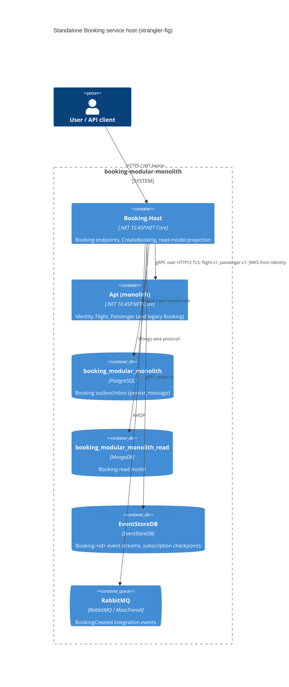

# 0008. Standalone Booking service host (strangler-fig extraction of the Booking module)

- **Status:** Proposed
- **Date:** 2026-10-06
- **ARB ticket:** TO BE CREATED
- **Authors:** Booking platform (via Devin, ticket [AB-241](https://cog-gtm.atlassian.net/browse/AB-241))
- **Owning team:** Booking platform team (owners of `src/Modules/Booking` and `src/Services/Booking`)
- **Related ADRs:** 0001 (service boundaries), 0002 (strangler-fig), 0003 (gRPC sync + RabbitMQ async),
  0004 (database per service), 0006 (per-service databases and outbox isolation, AB-236),
  0007 (shared gRPC contracts and discovery-based addressing, AB-237)

## Context

Epic [AB-231](https://cog-gtm.atlassian.net/browse/AB-231) splits the modular monolith into one
service per module (ADR 0001). The earlier scaffolding tickets made that possible without changing
behaviour: integration events live in `Contracts.Messages` (AB-232), `BuildingBlocks` is split into
focused libraries (AB-233), every module owns its database and outbox/inbox (AB-236, ADR 0006), and
Booking reaches Flight/Passenger through versioned `Contracts.Grpc` clients addressed by logical
service name (AB-237, ADR 0007). All modules still only run inside `src/Api`.

Booking is the first consumer-side module to be extracted: it is event-sourced (EventStoreDB), keeps
a Mongo read model projected from an all-streams subscription, publishes `BookingCreated` through its
own Postgres outbox, and calls Flight and Passenger synchronously over gRPC in
`CreateBookingCommandHandler`. The monolith must keep working unchanged while the new host runs
alongside it (ADR 0002).

ARB triggers: T1 (new deployable service `Booking.Host`, Dockerfile, docker-compose service, Aspire
resource), T2 (the service takes runtime ownership of the Booking Postgres DB, the
`booking_modular_monolith_read` Mongo DB and Booking streams in EventStoreDB - no new store or data
class, but a change of which process owns them), T4 (Booking ↔ Flight/Passenger gRPC calls and the
`BookingCreated` RabbitMQ event now cross a process boundary). The detector's T4/T6/T7 hits on protos,
ADR 0006 text and the Dockerfile base image belong to the merged dependency PRs or are the existing
.NET 10 runtime, and are not new decisions here.

## Decision

We will add `src/Services/Booking/src/Booking.Host.csproj`, a standalone ASP.NET Core host that
composes only the Booking module (`AddBookingModules` / `UseBookingModules`) on top of
`ServiceDefaults` (OpenTelemetry, health endpoints, service discovery, HTTP resilience), JWT auth
against the existing Identity authority, RabbitMQ MassTransit scanning only the Booking assembly,
and readiness checks for every store it owns (Postgres outbox, Mongo read model, EventStoreDB,
RabbitMQ) plus the Flight/Passenger gRPC health checks registered by the module. It resolves
`https://flight` / `https://passenger` through `Services:<name>:https:0` (config, Aspire env or cluster
DNS) and, until the Flight/Passenger hosts (AB-239/AB-240) exist, points them at the monolith, which
still serves those gRPC services. The monolith keeps hosting Booking too; traffic cut-over to the new
host is a gateway decision outside this ADR.

## Alternatives considered

| Alternative | Pros | Cons | Why rejected |
| --- | --- | --- | --- |
| Do nothing (Booking stays in `src/Api`) | No new deployable | Blocks AB-231; Booking cannot scale or deploy independently | Epic goal |
| Copy Booking DI/infrastructure into a new host | Host fully decoupled from module extension methods | Two copies of the composition drift; violates "module owns its registrations" | Re-use `AddBookingModules` instead |
| Host Booking + Flight + Passenger together | No cross-process gRPC yet | Not independently deployable; still shares a process | Defeats the extraction; separate tickets own the other hosts |
| Separate repo/solution for Booking | Hard isolation | Loses shared building blocks/contracts until packages are published | Premature; split libraries are project references today |

## Architecture

## Non-functional requirements

| NFR | Target | How met |
| --- | --- | --- |
| Availability SLO | TBD - owner to confirm before ARB | `/alive` liveness, `/health` readiness incl. owned stores and Flight/Passenger gRPC |
| p95 latency | TBD - owner to confirm before ARB | gRPC deadline 10s, 3 attempts on `UNAVAILABLE` (ADR 0007) |
| RPO / RTO | Unchanged from monolith (same stores) | No new store; ownership only |
| Peak load | TBD - owner to confirm before ARB | Stateless host, scale horizontally |
| Scaling model | Horizontal replicas behind gateway | EventStoreDB subscription checkpoint is shared; multiple replicas need competing/persistent subscription (follow-up) |
| Data retention | Unchanged | - |

## Security & compliance

- **Data classification:** Booking holds passenger name and trip data already stored by the monolith; no new data class.
- **Encryption at rest:** Unchanged (inherits store configuration).
- **Encryption in transit:** HTTPS for the public API; gRPC over TLS to Flight/Passenger. `AcceptAnyServerCertificate` is enabled only in `appsettings.docker.json` for the self-signed compose certificate.
- **AuthN / AuthZ:** JWT bearer validated against the existing Identity authority; same `ApiScope` policy as the monolith endpoints.
- **Secrets:** Local/dev credentials only in appsettings (same as `src/Api`); production values must come from environment/secret store.
- **Audit logging:** OpenTelemetry traces/logs via `ServiceDefaults`; correlation id middleware.
- **Data residency / regions:** N/A - no cloud resources in this change.
- **Policy sections satisfied:** No `policy/approved-infra.yaml` in the repo and no cloud IaC added.
- **Threats considered:** Dual-writer risk while both hosts serve Booking (same streams/read DB) - mitigated by routing Booking traffic to only one host at a time.

## Cost

| Item | Assumption | Monthly estimate |
| --- | --- | --- |
| One extra container (Booking.Host) | Local/compose only in this change | TBD - owner to confirm before ARB |
| **Total** | | TBD |

## Operations

- **On-call rotation:** Booking platform team (TBD).
- **Runbook:** TBD - `docs/runbooks/booking-service.md` to be added with the gateway cut-over ticket.
- **Dashboards / alarms:** OTLP/Prometheus exporters from `ServiceDefaults` (`ObservabilityOptions.ServiceName = "Booking Service"`).
- **Rollback plan:** Route Booking traffic back to `src/Api` (still hosts Booking); stop the container.
- **Migration / cut-over plan:** Run both, switch the gateway route for `/api/v1/booking*` to `Booking.Host`, then remove Booking from `src/Api` in a later ticket.

## Policy exceptions requested

| Rule | Resource | Justification | Compensating control | Expiry |
| --- | --- | --- | --- | --- |
| none | | | | |

## Consequences

- Positive: Booking can be built, deployed and scaled independently; cross-process gRPC and broker paths are exercised before the other hosts land.
- Negative / risks: Until cut-over both hosts can write Booking streams; the all-streams subscription uses a single checkpoint id (`default`), so running the monolith and Booking.Host projections concurrently processes events twice.
- Follow-ups: Point `Services:flight`/`Services:passenger` at the Flight/Passenger hosts when AB-239/AB-240 land; per-service subscription checkpoint ids; gateway routing; remove Booking from `src/Api`.

## Open questions

- SLO, latency, load and cost numbers (owner to confirm before ARB).
- Should the all-streams subscription filter to Booking streams/event types only?
