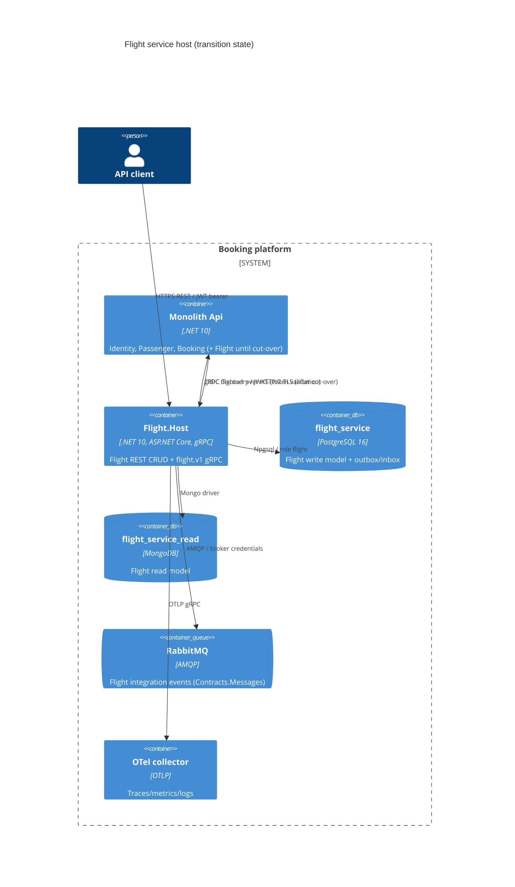

# 0008. Standalone Flight service host (first strangler-fig extraction)

- **Status:** Proposed
- **Date:** 2026-10-06
- **ARB ticket:** TO BE CREATED
- **Authors:** Booking platform (via Devin, ticket [AB-239](https://cog-gtm.atlassian.net/browse/AB-239))
- **Owning team:** Booking platform team (owners of `src/Modules/*`, `src/Services/*` and `src/BuildingBlocks`)
- **Related ADRs:** 0001 (service boundaries), 0002 (strangler-fig migration), 0003 (gRPC sync + RabbitMQ async),
  0004 (database per service), 0006 (per-service database and outbox isolation), 0007 (shared gRPC contracts and
  service addressing)

## Context

ADR 0002 extracts services one at a time, Flight first. Until now the Flight module (`src/Modules/Flight`) only runs
inside the monolith host (`src/Api`), so it cannot be deployed, scaled or released independently, and its gRPC
server (`FlightGrpcServices`) is only reachable in-process. AB-236 (per-module databases + outboxes) and AB-237
(shared `Contracts.Grpc` protos, discovery addressing, gRPC health) removed the blockers; this change adds the
deployable unit.

Constraints: the monolith must keep building and behaving the same (strangler-fig), the Flight module code must not
be forked, and the Identity, Passenger and Booking hosts are being scaffolded in parallel, so shared-file edits are
kept to the minimum.

ARB triggers: T1 (new deployable component: `src/Services/Flight/Flight.Host` + Dockerfile + `flight_service`
Compose service), T2 (new data stores: Postgres database `flight_service` and Mongo database `flight_service_read`).
The detector also flagged items inherited from the dependency PRs merged into this branch (T4 protos, T6/T2 text in
ADR 0006, T3 URLs in docs/tests, `src/Api/Dockerfile`); those are covered by ADRs 0006/0007 and their own PRs. T7 on
`mcr.microsoft.com/dotnet/sdk:10.0` is the repo's existing runtime (`global.json`), not a version change.

## Decision

We will add `Flight.Host` (`src/Services/Flight/Flight.Host`), an ASP.NET Core host that composes the existing Flight
module (`AddFlightModules` / `UseFlightModules`) with service defaults (health checks, OpenTelemetry, service
discovery), JWT validation against Identity (still in the monolith), MassTransit on **RabbitMQ**, the Flight gRPC
server and the gRPC health service on a single HTTP/1.1+HTTP/2 TLS endpoint. It owns its own Postgres database
`flight_service` (role `flight`, holding the write model, EF migrations history and the Flight outbox/inbox
`persist_message` table from ADR 0006) and Mongo read database `flight_service_read`; migrations and the
`FlightDataSeeder` run at startup. The monolith keeps hosting the Flight module against its existing stores
(`flight_modular_monolith`) until a later cut-over ticket routes traffic (gateway + `Services:flight` address) to the
new host and removes Flight from `src/Api`. The Flight integration/E2E test suites boot `Flight.Host` instead of `Api`.

## Alternatives considered

| Alternative | Pros | Cons | Why rejected |
| --- | --- | --- | --- |
| Do nothing | No new deployable | Flight cannot be released/scaled independently; blocks AB-231 | Blocks the migration plan (ADR 0002) |
| New host shares the monolith's `flight_modular_monolith` DB | No data divergence before cut-over | Two hosts run migrations and two outbox pollers race on one `persist_message` table (monolith publishes in-memory, service to RabbitMQ), so events could be lost to the wrong transport; violates "one owner per store" | Unsafe dual ownership; cut-over can migrate data once |
| Copy Flight code into a new service project | Service evolves freely | Forked business logic, double maintenance, divergence | Module reuse keeps one implementation until cut-over |
| Generic shared `ServiceHost` library for all four hosts (PR #82 approach) | Less per-host code | New shared component touched by four parallel tickets; merge conflicts, broader blast radius | Per-host composition is ~75 lines and can be consolidated later |

## Architecture

## Non-functional requirements

| NFR | Target | How met |
| --- | --- | --- |
| Availability SLO | TBD — owner to confirm before ARB | `/health`, `/alive`, `grpc.health.v1` probes; stateless host, can run N replicas |
| p95 latency | TBD — owner to confirm before ARB | Same code path as the monolith; no extra hop until cut-over |
| RPO / RTO | TBD — owner to confirm before ARB | Postgres/Mongo backups per environment (not defined in this repo) |
| Peak load | TBD — owner to confirm before ARB | |
| Scaling model | Horizontal (stateless); single DB | Outbox poller is DB-backed; concurrency across replicas TBD |
| Data retention | Unchanged from the Flight module | |

## Security & compliance

- **Data classification:** Flight reference data (airports, aircraft, flights, seats) — no PII. Outbox rows hold
  serialized Flight integration events.
- **Encryption at rest:** Per environment database configuration (not managed in this repo).
- **Encryption in transit:** HTTPS/HTTP2 TLS for REST and gRPC (dev certificate locally); DB and broker links are
  plaintext in local Compose, as for the monolith.
- **AuthN / AuthZ:** Same JWT bearer validation and `ApiScope` policy as the monolith, Identity remains the issuer.
- **Secrets:** Local/Compose credentials in appsettings, same as the monolith; real environments must inject them.
- **Audit logging:** Unchanged (structured logs + OTel).
- **Data residency / regions:** N/A — no cloud resources added.
- **Policy sections satisfied:** No `policy/approved-infra.yaml` in repo; no cloud/IaC resources added.
- **Threats considered:** New network listener (5100/5101) exposes the same endpoints already exposed by the monolith;
  `flight_service` is reachable only by role `flight` (`REVOKE CONNECT ... FROM PUBLIC`).

## Cost

| Item | Assumption | Monthly estimate |
| --- | --- | --- |
| Flight.Host container | One extra small container per environment | TBD — owner to confirm before ARB |
| `flight_service` / `flight_service_read` | Logical DBs on the existing Postgres/Mongo servers | ~0 incremental |
| **Total** | | TBD (expected well below $2k/mo) |

## Operations

- **On-call rotation:** Booking platform team (TBD).
- **Runbook:** TBD — to be added with the deployment ticket.
- **Dashboards / alarms:** OTel service name `Flight Service` / `flight_service`; health endpoints for probes.
- **Rollback plan:** Stop/remove the `flight_service` container; the monolith still serves Flight, nothing routes to
  the new host yet.
- **Migration / cut-over plan:** Later ticket: migrate Flight data to `flight_service`, point the gateway and
  `Services:flight` at the host, remove Flight from `src/Api`.

## Policy exceptions requested

| Rule | Resource | Justification | Compensating control | Expiry |
| --- | --- | --- | --- | --- |
| none | | | | |

## Consequences

- Positive: Flight is independently buildable, deployable and testable; REST and gRPC are reachable cross-process;
  integration events go to a real broker.
- Negative / risks: Until cut-over two Flight instances exist with separate data; clients must not mix them. Outbox
  polling with multiple replicas needs confirming.
- Follow-ups: cut-over/data migration ticket; Kubernetes/Helm manifests; `src/Api/Dockerfile` still references the
  pre-split `BuildingBlocks.csproj` (inherited from the dependency merges).

## Open questions

- NFR targets and cost owner sign-off.
- Data migration strategy from `flight_modular_monolith` to `flight_service` at cut-over.
- Should multiple Flight.Host replicas coordinate outbox polling (leader election / row locking)?
- Deployed environments must use an HTTPS `Jwt:MetadataAddress` pointing to an internal Identity endpoint with a certificate valid for its DNS name; the plain-HTTP metadata address in `appsettings.docker.json` is accepted only for the local docker-compose profile.
- Should the Flight gRPC service, particularly `ReserveSeat`, require authorization? It currently matches the monolith and has no policy; requiring authorization would change the Booking→Flight client contract by requiring token forwarding.
- Should dependency readiness checks for Postgres, MongoDB, and RabbitMQ be enabled per environment through `HealthOptions.Enabled`? They are currently disabled, matching the monolith.
- `src/Api/src/appsettings.docker.json` (pre-existing on `main`) lacks a Mongo override, so the monolith container cannot start under Compose without one.
