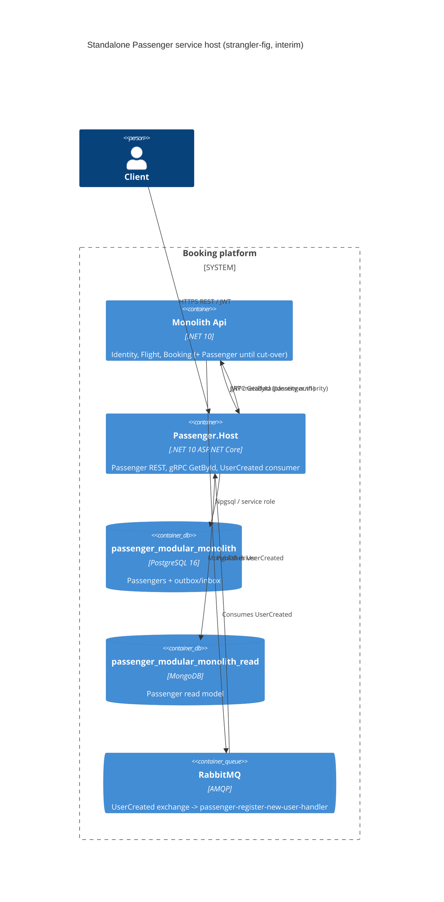

# 0011. Standalone Passenger service host

- **Status:** Proposed
- **Date:** 2026-10-06
- **ARB ticket:** TO BE CREATED
- **Authors:** Booking platform (via Devin, ticket [AB-240](https://cog-gtm.atlassian.net/browse/AB-240))
- **Owning team:** Booking platform team (owners of `src/Modules/Passenger` and `src/Services/*`)
- **Related ADRs:** 0001 (service boundaries), 0002 (strangler-fig migration), 0003 (gRPC sync + RabbitMQ async), 0004 (data ownership), 0005 (contract versioning) — from AB-230; 0006 (per-service database and outbox isolation, AB-236); 0007 (shared gRPC contracts and service addressing, AB-237)

## Context

Epic AB-231 splits the modular monolith into independently deployable services using the
strangler-fig pattern (ADR 0002). The prerequisite tickets are in review: integration events live in
`Contracts.Messages` (AB-232), BuildingBlocks is split into focused libraries (AB-233), each module
owns its own Postgres database and outbox/inbox (AB-236, ADR 0006), the bus runs on RabbitMQ
(AB-235), and gRPC contracts plus discovery-based addressing live in `Contracts.Grpc` (AB-237,
ADR 0007).

Passenger is the first module to get its own process. It exposes REST endpoints, the
`PassengerGrpcService.GetById` gRPC endpoint used by Booking, a MongoDB read model, and a
MassTransit consumer (`RegisterNewUserHandler`) for Identity's `UserCreated` event. Today all of
this only runs inside `src/Api`.

Constraints: .NET 10 / ASP.NET Core (already the repo runtime), MassTransit 8 on RabbitMQ,
EF Core + Npgsql, MongoDB driver, Aspire `ServiceDefaults` for OpenTelemetry/health/discovery.
The monolith must keep working unchanged while other host-split tickets (Identity/Flight/Booking)
proceed in parallel.

ARB triggers: T1 (new deployable service `Passenger.Host` with its own Dockerfile), T4 (Identity's
`UserCreated` now crosses a process boundary to a dedicated `passenger-register-new-user-handler`
queue; `passenger.v1` gRPC is served out-of-process), T6 (new network listeners: HTTP :5102 and gRPC
h2c :5202, JWT-validated against the monolith-hosted Identity). The triage detector's T3 hits are
documentation URLs (`learn.microsoft.com`, `json.schemastore.org`) and its T7 hit is the existing
.NET 10 base image; both are discounted.

## Decision

We will add `src/Services/Passenger.Host`, an ASP.NET Core host that composes only the Passenger
module (`AddPassengerModules` / `UsePassengerModules`) plus the shared plumbing it needs
(ServiceDefaults, Jwt, MassTransit, gRPC + gRPC health, ProblemDetails, Web). It:

- references only `Passenger`, the split `BuildingBlocks.*` libraries it uses, `Contracts.Messages`
  and `Contracts.Grpc` (no Api/Flight/Identity/Booking reference, enforced by a test);
- registers MassTransit with the Passenger assembly only, under `MessageBroker:ServiceName =
  passenger`, so `UserCreated` is delivered to its own queue `passenger-register-new-user-handler`;
- owns the Passenger Postgres database (`passenger_modular_monolith`, role `passenger`) including its
  outbox/inbox (`persist_message`), and the Passenger Mongo read database;
- serves `passenger.v1.PassengerGrpcService` and `grpc.health.v1` on a dedicated HTTP/2 endpoint and
  REST/health on an HTTP/1.1 endpoint;
- adds host-local readiness checks (Postgres, MongoDB; RabbitMQ via MassTransit's bus check).

The monolith keeps hosting Passenger until traffic is cut over; the host lives alongside it.

## Alternatives considered

| Alternative | Pros | Cons | Why rejected |
| --- | --- | --- | --- |
| Do nothing | No new deployable | Blocks AB-231; Passenger can't scale or deploy independently | Epic goal |
| Shared `ServiceHost` library used by all service hosts (prior PR #81) | Less duplication across 4 hosts | New shared platform component (T8) coupling all hosts; conflicts with parallel host tickets | Each host self-composes for now; extract later if duplication proves stable |
| Run Passenger host and monolith Passenger against separate copies of the data | Clean isolation during transition | Needs data sync/backfill; dual-write risk | Single owned DB with the monolith as interim co-tenant is simpler; see cut-over plan |

## Architecture

## Non-functional requirements

| NFR | Target | How met |
| --- | --- | --- |
| Availability SLO | Same as monolith (no SLO defined yet) | Stateless host, horizontally scalable; `/health` readiness covers Postgres, Mongo, bus |
| p95 latency | GetById unchanged vs in-process gRPC hop (TBD in load test) | Read served from Mongo read model |
| RPO / RTO | Inherits Postgres/Mongo backup policy | No new stores; existing Passenger databases |
| Peak load | Unknown; demo scale | MassTransit competing consumers on one queue |
| Scaling model | Horizontal replicas behind discovery name `passenger` | Inbox dedup makes redelivery idempotent |
| Data retention | Unchanged | Same databases |

## Security & compliance

- **Data classification:** Passenger PII (name, passport number) — unchanged stores, now accessed by a separate process.
- **Encryption at rest:** Unchanged (inherits database configuration).
- **Encryption in transit:** Local/dev uses plaintext HTTP and h2c; production must terminate TLS (follow-up).
- **AuthN / AuthZ:** REST endpoints validate JWTs issued by Identity (`Jwt:Authority`); gRPC GetById keeps its current (unauthenticated, internal-only) posture.
- **Secrets:** Connection strings/broker credentials come from configuration; dev defaults only in appsettings, production via environment/secret store.
- **Audit logging:** Structured logs + OpenTelemetry traces via ServiceDefaults.
- **Data residency / regions:** Unchanged.
- **Policy sections satisfied:** No new infrastructure resource types; container image built from Microsoft base images.
- **Threats considered:** Duplicate message handling (inbox), cross-service data access (separate DB role), unauthenticated internal gRPC (network-policy restriction required in deployment).

## Cost

| Item | Assumption | Monthly estimate |
| --- | --- | --- |
| One additional container (Passenger.Host) | 1–2 small replicas | Low (< $100) |
| **Total** | | **< $100** |

## Operations

- **On-call rotation:** Booking platform team.
- **Runbook:** `src/Services/Passenger.Host/README.md` (ports, config, run instructions).
- **Dashboards / alarms:** OpenTelemetry service name `Passenger Service`; reuse existing collector/Grafana stack.
- **Rollback plan:** Stop the Passenger.Host deployment; the monolith still hosts Passenger, and messages remain on the durable queue.
- **Migration / cut-over plan:** Deploy alongside the monolith → route Booking's `passenger` discovery name and the gateway to Passenger.Host → remove Passenger from `src/Api` composition in a follow-up ticket. Until then both processes share the Passenger database and bind separate queues to `UserCreated`; the consumer's passport-number existence check prevents duplicate rows, but the double consumption must be removed at cut-over.

## Policy exceptions requested

| Rule | Resource | Justification | Compensating control | Expiry |
| --- | --- | --- | --- | --- |
| none | | | | |

## Consequences

- Positive: Passenger builds, deploys, and scales independently; first proof of the AB-231 service boundary.
- Negative / risks: Interim double consumption of `UserCreated` (monolith queue + Passenger queue) against the same database; per-host composition code duplicated across service hosts.
- Follow-ups: remove Passenger from `src/Api` at cut-over; TLS + network policy for gRPC; add Passenger.Host to Aspire AppHost and docker-compose/k8s manifests; consider extracting shared host composition once all four hosts exist.

## Open questions

- Should the Aspire AppHost / docker-compose include Passenger.Host now, or in the cut-over ticket?
- Should gRPC GetById require service-to-service auth once it is out-of-process?
