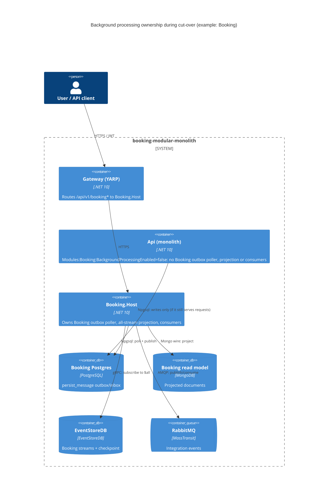

# 0013. Per-module background-processing switch in the monolith during cut-over

- **Status:** Proposed
- **Date:** 2026-10-06
- **ARB ticket:** TO BE CREATED
- **Authors:** Platform (via Devin, epic [AB-231](https://cog-gtm.atlassian.net/browse/AB-231))
- **Owning team:** Platform team (owners of `src/Api` and `src/BuildingBlocks`); each module team owns flipping its own switch at cut-over
- **Related ADRs:** 0002 (strangler-fig), 0006 (per-service databases and outbox isolation),
  0008 (API gateway single ingress), 0009–0012 (standalone Identity, Flight, Passenger and Booking hosts)

## Context

During the strangler-fig migration (ADR 0002) a module runs in two processes at once: inside the
monolith (`src/Api`) and in its standalone host (`src/Services/*`, ADRs 0009–0012). The gateway
(ADR 0008) decides which process serves a module's HTTP traffic, but nothing decides which process
runs the module's **background work**:

- the outbox/inbox poller `PersistMessageBackgroundService<TModule>` (publishes integration events
  and executes internal commands, which is also how Flight and Passenger sync their Mongo read
  models);
- the EventStoreDB all-stream subscription that projects Booking events into the Mongo read model
  (single checkpoint id `default`);
- the module's MassTransit consumers (with RabbitMQ, AB-235, the monolith and a host bind separate
  queues, so both receive every event).

When both processes point at the same module stores this work runs twice. Observed while testing
the Wave 1 hosts: one Booking event produced two Mongo read-model documents and an EventStore
checkpoint conflict in the monolith; Identity's `UserCreated` was published twice.
`PersistMessageOptions.Enabled` existed but was never read.

ARB triggers: T4 (which process consumes and publishes cross-domain events changes per module at
cut-over) and T8 (shared `BuildingBlocks` behaviour used by every module team). No new service,
store, vendor, auth or network change (T1/T2/T3/T5/T6/T7/T9 not triggered).

## Decision

We will add a per-module configuration switch `Modules:<Module>:BackgroundProcessingEnabled`
(default `true`) read through `IConfiguration.IsModuleBackgroundProcessingEnabled(module)` in
`BuildingBlocks.Core`. When it is `false` for a module, the composing host does not register that
module's `PersistMessageBackgroundService<TModule>`, its EventStoreDB all-stream subscription
(Booking) or, in `src/Api`, its MassTransit consumers; request handling, the module's DbContexts,
outbox writes and gRPC services stay registered. The switch is intended to be set to `false` in the
monolith once the module's standalone host takes over (`Modules__Booking__BackgroundProcessingEnabled=false`);
the monolith logs a warning per disabled module at startup. The unused `PersistMessageOptions.Enabled`
is removed. Defaults keep today's behaviour.

## Alternatives considered

| Alternative | Pros | Cons | Why rejected |
| --- | --- | --- | --- |
| Do nothing | No code | Duplicate events, duplicate read-model documents and checkpoint conflicts whenever both processes run | Breaks side-by-side running required by ADR 0002 |
| Option B: outbox row locking (`SELECT … FOR UPDATE SKIP LOCKED`) + idempotent projections / per-host checkpoint ids | Safe with any number of processors; needed later for horizontal scaling | Larger change across every module's outbox and projections; still lets two processes consume from separate queues | Deferred by the product owner; may follow for multi-replica scaling |
| Wire up the global `PersistMessageOptions.Enabled` | Smallest change | All-or-nothing across modules; does not cover EventStore projections or consumers | Cut-over is per module |
| Remove modules from `src/Api` at cut-over instead | Clean end state | Not instantly reversible; ADR 0002 keeps the monolith as rollback until burn-in | Too early; done after burn-in |

## Architecture

## Non-functional requirements

| NFR | Target | How met |
| --- | --- | --- |
| Availability SLO | Unchanged | Switch only moves background work between processes |
| p95 latency | Unchanged | No request-path change |
| RPO / RTO | Unchanged; outbox rows written while no process has the switch on are delivered once a processor is enabled again | Outbox is durable |
| Peak load | Unchanged | - |
| Scaling model | Exactly one process per module runs background work; multi-replica requires option B | Documented constraint |
| Data retention | Unchanged | - |

## Security & compliance

- **Data classification:** unchanged; no new data flows.
- **Encryption at rest / in transit:** unchanged.
- **AuthN / AuthZ:** unchanged. Service-to-service gRPC stays unauthenticated (tracked separately).
- **Secrets:** none added; switch is plain configuration.
- **Audit logging:** startup warning per disabled module.
- **Data residency / regions:** N/A — no cloud resources.
- **Policy sections satisfied:** no `policy/approved-infra.yaml` in the repo; no IaC added.
- **Threats considered:** misconfiguration (switch off in every process) stalls event delivery and read models — mitigated by the startup warning, default `true`, and the cut-over checklist below.

## Cost

| Item | Assumption | Monthly estimate |
| --- | --- | --- |
| None | Config-only switch | $0 |
| **Total** | | $0 |

## Operations

- **On-call rotation:** Platform team (TBD).
- **Runbook / cut-over checklist (per module):** (1) start the standalone host with background processing on; (2) set `Modules__<Module>__BackgroundProcessingEnabled=false` on the monolith and restart it; (3) flip the gateway route (ADR 0008); (4) watch the outbox backlog and read-model lag. Never leave a module with the switch off in every process.
- **Dashboards / alarms:** existing OpenTelemetry/Prometheus from `ServiceDefaults`; follow-up: alert on outbox backlog age.
- **Rollback plan:** set the switch back to `true` (or remove it) on the monolith and restart; route traffic back.
- **Migration / cut-over plan:** used at each module's cut-over; data migration into the per-service databases happens in AB-248.

## Policy exceptions requested

| Rule | Resource | Justification | Compensating control | Expiry |
| --- | --- | --- | --- | --- |
| none | | | | |

## Consequences

- Positive: the monolith and a standalone host can run side by side without duplicate events, duplicate read-model documents or checkpoint conflicts; per-module and instantly reversible.
- Negative / risks: relies on operators setting the switch correctly; does not make background work safe for multiple replicas of the same host.
- Follow-ups: option B (row locking + idempotent projections / per-host checkpoint ids) before scaling hosts horizontally; outbox-backlog alerting; remove the module from `src/Api` after burn-in.

## Open questions

- Owner and on-call rotation for flipping the switch at each cut-over.
- Should hosts refuse to start if the switch is off for the only module they compose?
