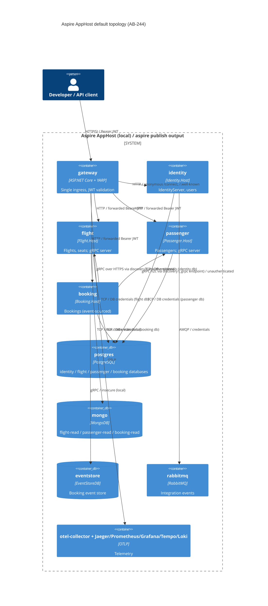

# 0014. Aspire AppHost orchestrates the gateway and four standalone services

- **Status:** Proposed
- **Date:** 2026-10-06
- **ARB ticket:** TO BE CREATED
- **Authors:** Devin (for AB-244)
- **Owning team:** Booking platform team (owners of `booking-modular-monolith`)
- **Related ADRs:** 0003 Inter-service communication, 0006 Per-service database and outbox isolation, 0007 Discovery-based service addressing, 0008 API gateway single ingress, 0009–0012 Standalone Identity/Flight/Passenger/Booking hosts, 0013 Per-module background-processing switch

## Context

ADRs 0009–0012 added standalone hosts for Identity, Flight, Passenger and Booking, and ADR 0008 put a YARP
gateway in front of everything. The Aspire AppHost (`src/Aspire/src/AppHost/Program.cs`) still modelled the
pre-split topology: one `api` project referencing every database, Mongo, EventStoreDB and RabbitMQ, every gateway
cluster pointing at the monolith, and Booking's `flight`/`passenger` discovery names pointing back at the monolith.
Local development therefore did not exercise the production layout, and `aspire publish` emitted a compose file
without the extracted services. AB-244 asks for the AppHost to model the microservices topology.

Constraints: service-to-service gRPC stays unauthenticated for now; each service owns its own database (data
migration is AB-248); if the monolith and a standalone host ever share module stores, the monolith's
`Modules:<Module>:BackgroundProcessingEnabled` switch (ADR 0013) must be off for that module. Dockerfiles/compose
(AB-242), dashboards/trace propagation (AB-246) and test projects other than the AppHost model tests (AB-247) are
out of scope.

ARB triggers: T1 (the AppHost is the deployment model for `aspire publish`; its default output now contains four
service containers instead of the monolith), T6 (the token issuer and every service's `Jwt:Authority` move from the
monolith to the standalone Identity host; gateway clusters route to the services instead of the monolith).
The heuristic detector reported no triggers (changes are in C# AppHost code, not IaC); the triggers above come from
reading the diff.

## Decision

We will make the microservices layout the AppHost's default topology: the gateway plus `identity`, `flight`,
`passenger` and `booking` project resources, each referencing only its own PostgreSQL database
(`ConnectionStrings:<service>`), its own Mongo read database (`<service>-read`), EventStoreDB (Booking only) and
RabbitMQ. The Identity host's endpoint is the issuer (`AuthOptions:IssuerUri`) and the `Jwt:Authority` of every
service and the gateway. Booking references Flight and Passenger, so Aspire injects `services__<name>__<endpoint>__0`
and Booking resolves `https://flight` and `http://_grpc.passenger` (Passenger's HTTP/2-only gRPC endpoint) through
service discovery — no addresses are hard-coded. Each gateway cluster defaults to its service's HTTP endpoint; the
`monolith` fallback cluster defaults to Identity (IdentityServer UI / discovery). `Gateway:Clusters:<cluster>` still
overrides one cluster. The monolith stays available for rollback/comparison with `AppHost:Topology=Monolith`, which
restores the previous single-`api` wiring. The two topologies never run side by side, so neither needs the
ADR 0013 switch turned off. Observability is unchanged: every host calls `AddServiceDefaults()`, so the existing
OTel collector, Jaeger, Prometheus, Grafana, Tempo and Loki receive per-service telemetry. Postgres database resources
are renamed `<service>-db` (database names unchanged) so the service projects own the logical names used for discovery.

## Alternatives considered

| Alternative | Pros | Cons | Why rejected |
| --- | --- | --- | --- |
| Do nothing (monolith-only AppHost, override clusters by hand) | No change | Local dev never runs the production layout; `aspire publish` omits the services; manual `Gateway:Clusters` overrides need hard-coded addresses | Fails AB-244 acceptance |
| Run the monolith and all four services side by side by default | Can compare responses live | Two IdentityServers (two issuers), two consumers per queue; requires the ADR 0013 switches and shared or duplicated stores; heavier local footprint | Confusing default; rollback only needs the monolith on demand |
| Separate AppHost project per topology | No runtime flag | Duplicated infrastructure wiring that drifts; more projects in the sln (shared-file churn with parallel tickets) | A single config flag is simpler |

## Architecture

## Non-functional requirements

| NFR | Target | How met |
| --- | --- | --- |
| Availability SLO | N/A for local orchestration; production SLOs TBD — owner to confirm before ARB | Health checks per resource (`/health`) feed the Aspire dashboard and `WaitFor` ordering |
| p95 latency | TBD — owner to confirm; one extra network hop for Booking→Flight/Passenger compared with in-process calls in the monolith | gRPC with deadlines/retries from ADR 0007 |
| RPO / RTO | Unchanged from ADR 0006 (per-service databases) | — |
| Peak load | TBD — owner to confirm | — |
| Scaling model | Each service scales independently in published environments | Separate project resources |
| Data retention | Unchanged | — |

## Security & compliance

- **Data classification:** Unchanged; passenger PII stays in the Passenger and Identity databases only. Each service now receives only its own connection strings (previously the single `api` received all of them).
- **Encryption at rest:** Unchanged (local containers; production per existing policy).
- **Encryption in transit:** Client→gateway HTTPS available on 5001; gateway→service HTTP inside the Aspire/compose network (same posture as ADR 0008); Booking→Flight gRPC over HTTPS locally, Booking→Passenger gRPC h2c.
- **AuthN / AuthZ:** Identity host is the single issuer; gateway and all services validate JWTs against it. Service-to-service gRPC unauthenticated (user decision; ARB follow-up).
- **Secrets:** None added. Postgres/Mongo/RabbitMQ credentials keep using existing AppHost parameters.
- **Audit logging:** Unchanged; per-service OTel logs/traces via ServiceDefaults.
- **Data residency / regions:** Unchanged.
- **Policy sections satisfied:** No new cloud resources or IaC; container images unchanged.
- **Threats considered:** Least privilege improves (connection strings scoped per service). Unauthenticated internal gRPC remains an accepted risk (tracked).

## Cost

| Item | Assumption | Monthly estimate |
| --- | --- | --- |
| Local orchestration | Developer machines | $0 |
| Published topology | Four service containers instead of one monolith container | TBD — owner to confirm against hosting; expected well under the $2k flag |
| **Total** | | TBD (< $2k/month expected) |

## Operations

- **On-call rotation:** Same rotation as `booking-modular-monolith` (TBD — owner to confirm).
- **Runbook:** README "Aspire" section: `aspire run` (microservices) or `aspire run -- --AppHost:Topology=Monolith` (monolith).
- **Dashboards / alarms:** Aspire dashboard lists each service; existing Grafana/Jaeger receive per-service telemetry (dashboards owned by AB-246).
- **Rollback plan:** Run with `AppHost:Topology=Monolith` (or `AppHost__Topology=Monolith`); or repoint one gateway cluster with `Gateway:Clusters:<cluster>`.
- **Migration / cut-over plan:** Data migration from monolith databases to service databases is AB-248. Until then the two topologies keep separate data only in the sense that each runs alone; the shared container stores are reused by whichever topology is running.

## Policy exceptions requested

| Rule | Resource | Justification | Compensating control | Expiry |
| --- | --- | --- | --- | --- |
| none | | | | |

## Consequences

- Positive: local dev and `aspire publish` match the target topology; each service gets only its own resources; no hard-coded service addresses; one flag to fall back to the monolith.
- Negative / risks: more processes locally (slower startup); a token issued by the monolith topology is not valid in the microservices topology (different issuer); Grafana and the monolith's HTTPS endpoint still both use host port 3000 in monolith mode (pre-existing).
- Follow-ups: create the ARB ticket; AB-242 to align Dockerfiles/compose with the published model; AB-246 dashboards; gRPC authentication (ARB follow-up).

## Open questions

- Should a "side-by-side" topology (monolith + one extracted service with the ADR 0013 switch off) be added for per-module cut-over rehearsals?
- Production NFRs and cost baseline (owner to confirm).
