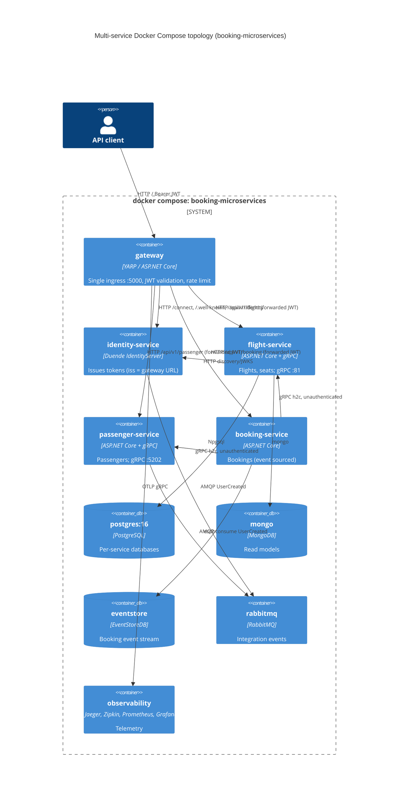

# 0014. Per-service container images and a multi-service Docker Compose topology

- **Status:** Proposed
- **Date:** 2026-10-06
- **ARB ticket:** TO BE CREATED
- **Authors:** Platform (via Devin, ticket [AB-242](https://cog-gtm.atlassian.net/browse/AB-242), epic [AB-231](https://cog-gtm.atlassian.net/browse/AB-231))
- **Owning team:** Platform team (owners of `deployments/docker-compose`, `src/Gateway`); each service team owns its own Dockerfile
- **Related ADRs:** 0002 (strangler-fig), 0004/0006 (database per service), 0007 (gRPC contracts and service addressing),
  0008 (API gateway single ingress), 0009–0012 (standalone Identity, Flight, Passenger and Booking hosts),
  0013 (per-module background-processing switch)

## Context

ADRs 0009–0012 added standalone hosts for every module and ADR 0008 put a YARP gateway in front of
the monolith, but the only runnable container topology was the monolith (`src/Api/Dockerfile`)
plus infrastructure. Two standalone hosts were bolted onto `docker-compose.yaml` next to the
monolith (sharing its stores, with HTTPS dev-cert mounts), Identity had a separate override file on
a network that no longer existed, and the Gateway Dockerfile no longer built (it copied the
pre-split `BuildingBlocks.csproj`). In Docker the Identity host issued tokens as
`http://identity-service` while the gateway and hosts validated `https://localhost:3000` against
the monolith's discovery document, so a token from the extracted Identity service was rejected
everywhere. The monolith's docker profile also pointed Mongo and EventStoreDB at `localhost`.

We need each service to ship as its own image and a single command that runs the full
multi-service topology locally, while keeping the monolith topology runnable for the strangler-fig
period.

ARB triggers: **T1** each service (Gateway, Identity, Flight, Passenger, Booking) becomes a separately
built and run container; **T6** the gateway's module clusters are repointed from the monolith to the
extracted services and the token issuer/authority changes for that topology. Not triggered: T2 (no
new store — reuses the existing Postgres/Mongo/EventStoreDB/RabbitMQ/Redis containers and the
per-service databases of ADR 0006), T3, T4 (contracts and events unchanged), T5 (local Docker only,
no cloud resources), T7, T8, T9.

## Decision

We will build one multi-stage image per deployable (`src/Gateway/Dockerfile`,
`src/Services/Identity/Dockerfile`, `src/Services/Flight/Flight.Host/Dockerfile`,
`src/Services/Passenger.Host/Dockerfile`, `src/Services/Booking/Dockerfile`, plus the existing
`src/Api/Dockerfile`), each buildable on its own from the repository root and checked in CI
(`.github/workflows/docker-images.yml`). We will run the extracted topology from a separate Compose
project, `deployments/docker-compose/docker-compose.services.yaml` (`name: booking-microservices`),
which `include`s `docker-compose.infrastructure.yaml` (data stores, broker and observability stack)
and adds `gateway`, `identity-service`, `flight-service`, `passenger-service` and `booking-service`
on plain HTTP inside the Compose network. The gateway reaches each service by repointing only the
module cluster destinations (`ReverseProxy__Clusters__<module>__Destinations__monolith__Address`,
as ADR 0008 prescribes). Identity issues tokens with the gateway's public URL as issuer
(`AuthOptions__IssuerUri = Jwt__Authority = ${JWT_ISSUER:-http://localhost:5000}`), and every service
fetches discovery/JWKS internally from `http://identity-service/.well-known/openid-configuration`
(`Jwt__MetadataAddress`). Booking calls Flight and Passenger over cleartext gRPC (Flight on a
dedicated `Http2` endpoint :81, Passenger on :5202) via the logical `http://flight` /
`http://passenger` addresses resolved by service discovery (ADR 0007); gRPC stays unauthenticated.
Every application container is gated on its `/health` readiness endpoint and starts only after its
infrastructure dependencies report healthy. The monolith keeps `docker-compose.yaml` (monolith +
gateway → monolith); the standalone hosts are removed from that file, so no module's store is shared
between two processes there and no ADR 0013 switch needs to be off.

## Alternatives considered

| Alternative | Pros | Cons | Why rejected |
| --- | --- | --- | --- |
| Do nothing | No change | Extracted services cannot be run together; gateway image doesn't build; extracted Identity tokens rejected | Fails AB-242 acceptance |
| Add the services to `docker-compose.yaml` next to the monolith (hybrid) | One file | Every module runs twice against shared stores, needs all ADR 0013 switches off plus HTTPS cert mounts; unclear which process serves what | Two clear topologies are easier to reason about and test; hybrid cut-over belongs to the per-module flip, not the default local setup |
| Compose profiles in a single file | One file, `--profile services` | Monolith and services would still share the same project, volumes and gateway definition with different env; profile mistakes silently start both | Separate projects isolate volumes and gateway config |
| Use `http://identity-service` as issuer | No env override for Identity | Internal hostname leaks into public tokens; discovery doc served via gateway advertises an issuer clients can't reach | Issuer should be the single ingress (ADR 0008) |

## Architecture

## Non-functional requirements

| NFR | Target | How met |
| --- | --- | --- |
| Availability SLO | N/A — local developer / demo topology | `restart` policies on infra; readiness-gated startup |
| p95 latency | N/A — local only | — |
| RPO / RTO | N/A — local volumes, disposable (`down -v`) | — |
| Peak load | N/A — single developer | — |
| Scaling model | One container per service; no replicas | Production orchestration TBD — owner to confirm before ARB |
| Data retention | Until `docker compose down -v` | Named volumes per Compose project |

## Security & compliance

- **Data classification:** test/seed data only (seeded users, flights, passengers).
- **Encryption at rest:** none (local Docker volumes); production: TBD — owner to confirm.
- **Encryption in transit:** none inside the Compose network (HTTP and h2c); the HTTPS dev-cert mount is no longer required for the extracted services. Production TLS termination: TBD.
- **AuthN / AuthZ:** JWT bearer issued by `identity-service`, validated by the gateway and by every service (issuer = `JWT_ISSUER`, audience `booking-modular-monolith`); service-to-service gRPC unauthenticated by decision (follow-up).
- **Secrets:** development-only credentials in Compose/appsettings (`guest/guest`, per-service Postgres roles, Duende developer signing key regenerated per container start). Must not be reused outside local Docker.
- **Audit logging:** gateway HTTP request logging; OpenTelemetry traces/logs to the existing collectors.
- **Data residency / regions:** N/A — local.
- **Policy sections satisfied:** no cloud infrastructure; `policy/approved-infra.yaml` not applicable.
- **Threats considered:** all service ports are published on the host for debugging, so the gateway is not the only reachable ingress locally; acceptable for a dev topology, not for deployment.

## Cost

| Item | Assumption | Monthly estimate |
| --- | --- | --- |
| Local Docker | Developer machines / CI runners | $0 |
| CI image builds | 6 extra GitHub Actions jobs per PR on `ubuntu-latest` | Within existing Actions minutes |
| **Total** | | **$0 new recurring spend** |

## Operations

- **On-call rotation:** repository maintainers (COG-GTM).
- **Runbook:** `docker compose -f deployments/docker-compose/docker-compose.services.yaml up -d --build` (multi-service) or `docker compose -f deployments/docker-compose/docker-compose.yaml up -d` (monolith); README "Docker Compose" section. The two cannot run at the same time (fixed infrastructure container names).
- **Dashboards / alarms:** existing Grafana/Jaeger/Zipkin from the infrastructure file; Compose health status per container.
- **Rollback plan:** use the monolith compose file; nothing in the monolith path depends on the new file.
- **Migration / cut-over plan:** data migration from monolith databases to per-service databases is AB-248; production manifests (Kubernetes/Aspire publish) are separate tickets.

## Policy exceptions requested

| Rule | Resource | Justification | Compensating control | Expiry |
| --- | --- | --- | --- | --- |
| none | | | | |

## Consequences

- Positive: each service image builds and runs on its own; one command brings up the full extracted topology through the gateway; token issuer/authority are consistent; CI catches broken Dockerfiles.
- Negative / risks: the monolith fallback cluster has no destination in the multi-service topology (unmatched paths return 502); Duende developer signing keys are regenerated on each Identity restart, invalidating issued tokens; full infrastructure + observability stack is heavy for a laptop.
- Follow-ups: authenticate service-to-service gRPC; persistent signing keys; production deployment manifests; data migration (AB-248).

## Open questions

- Production orchestration target and TLS termination for the extracted services — owner to confirm before ARB.
- Should the multi-service topology keep publishing each service's port on the host, or only the gateway's?
