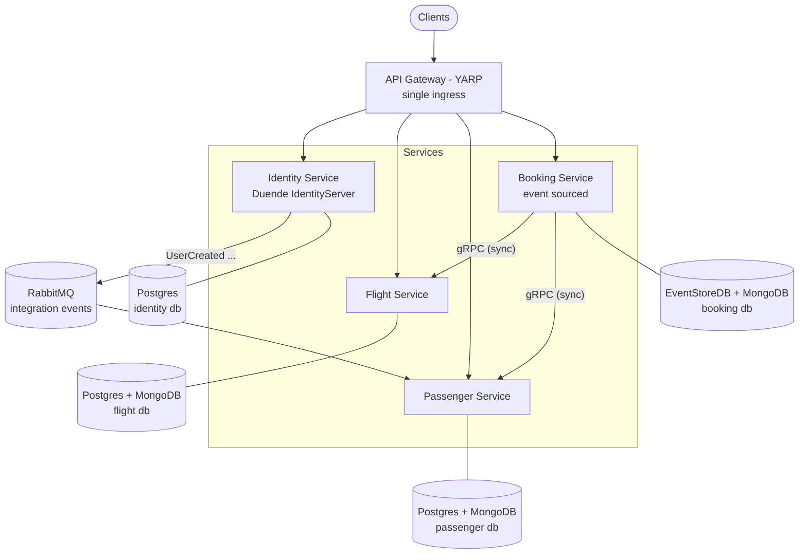

# Target Microservices Architecture

Target end state of the microservices migration. Decisions behind this diagram are
recorded in the [ADRs](adr/README.md).

## Target state



Key properties:

- **Single ingress**: all client traffic enters through the YARP API gateway (ADR 0002).
- **One service per former module** (ADR 0001).
- **Sync = gRPC, async = RabbitMQ** via MassTransit with per-service outbox/inbox (ADR 0003).
- **Database per service**, no cross-service data access (ADR 0004).
- **Versioned contracts** for protos and integration events (ADR 0005).

## Transition state (strangler fig)

While services are peeled off, the monolith keeps serving the modules that have not yet
been extracted; the gateway decides per route:

```text
                 +----------------------+
   Clients ----> |  API Gateway (YARP)  |
                 +----------+-----------+
                            |
        route flipped       |        routes not yet flipped
      +---------------------+---------------------+
      |                                           |
      v                                           v
+---------------+                     +-------------------------+
| Flight        |                     |  Modular Monolith       |
| Service       |<-- gRPC -- Booking--|  (remaining modules:    |
| (extracted)   |            module   |  Identity, Passenger,   |
+---------------+                     |  Booking, ...)          |
                                      +-------------------------+
                            both publish/consume via RabbitMQ
```

Recommended extraction order: Flight → Passenger → Booking → Identity. Each flip is
configuration-only and reversible; a module is removed from the monolith only after its
service has taken 100% of traffic.

## Related work

- AB-232: versioned integration-event contracts package
- AB-233: split `BuildingBlocks` into consumable libraries
- AB-234: YARP API gateway
- AB-235: RabbitMQ broker replacing in-memory MassTransit transport
- AB-236: per-service databases and outbox/inbox
- AB-237: shared proto packages and service addressing
